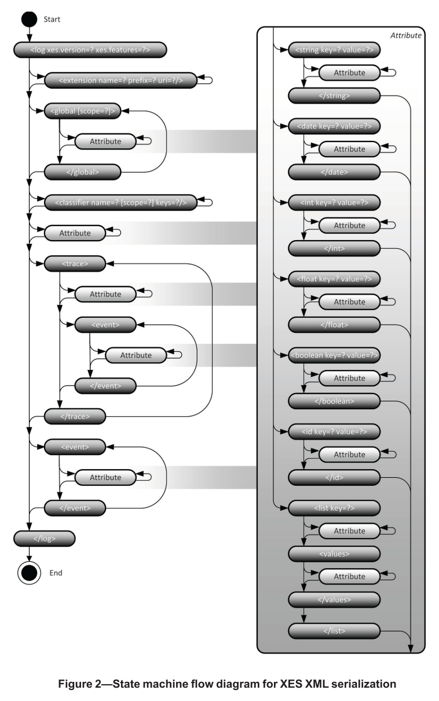

# eXtensible Event Stream (XES)
> IEEE stadard approved September 22 2016 and sponsored by the Standards Committee of the IEEE Computational Intelligence Society.

**Works:**
1. @book{IEEEComputationalIntelligenceSociety2016,
abstract = {The XES standard defines a grammar for a tag-based language whose aim is to provide designers of information systems with a unified and extensible methodology for capturing systems behaviors by means of event logs and event streams. This standard includes a XML Schema describing the structure of an XES event log/stream and a XML Schema describing the structure of an extension of such a log/stream. Moreover, the standard includes a basic collection of so-called XES extension prototypes that provide semantics to certain attributes as recorded in the event log/stream.},
author = {{IEEE Computational Intelligence Society}},
booktitle = {Proceedings of the IEEE},
file = {:Users/hermanplatou/code/private/Masters{\_}Literature/IEEE{\_}XES.pdf:pdf},
isbn = {9781504424219},
keywords = {IEEE 1849™,XML,event log,event stream,extensions,system behavior},
number = {June},
pages = {1--50},
title = {{Standard for eXtensible Event Stream (XES) for Achieving Interoperability in Event Logs and Event Streams}},
url = {https://ieeexplore.ieee.org/servlet/opac?punumber=7740856},
year = {2016}
}
2. @article{Verbeek2010,
author = {Verbeek, H. M.W. and Buijs, Joos C.A.M. and van Dongen, Boudewijn F. and van der Aalst, Wil M.P.},
file = {:Users/hermanplatou/code/private/Masters{\_}Literature/Verbeek2011{\_}Chapter{\_}XESXESameAndProM6.pdf:pdf},
journal = {Information Systems Evolution},
pages = {60--75},
title = {{XES, XESame, and ProM 6}},
year = {2010}
}
---

XES is a XML based standard for describing event logs and event streams. These logs are commonly exhanged between different information systems and other types of clients, and therefore need to adhere to a fixed and agreed upon standard. XES is this standard.  
It allows for use of external ontologies, thus having the capability of providing accurate semantics to its content. It is the IEEE standard for describing event logs and event streams. 

XES is designed to resolve some of the discovered issues with MXML, such as concept ambiguity in advanced scenarios. MXML has a series of predefined attributes which have well defined semantics, but lacks a mechanism for describing advanced concepts. It is whenever one tries to expand on any of these well defined attributes or introduce new ones that problems may arise. These concepts do not have to be only domain specific, it could just as well be generic concepts with ambiguity. The semantic meaning of these non-standard attributes are difficult to define in MXML. XES inherits many of the same attributes from MXML, but implement them  differently. XES is built on SA-MXML which is the semantic extension of MXML. XES therefore has a well defined mechanism for describing these complex concepts as one can link to ontologies. Understanding the differences of these formats is not paramount as we are only interested XES. However, the main featureset of XES can be described and demonstrated by presenting the main differences. 


Here is a simple MXML file from [XES, XESame, and ProM 6](./resources/literature/Verbeek2011_Chapter_XESXESameAndProM6.pdf). 
```
<WorkflowLog xmlns:xsi= ”http: www.w3.org 2001 XMLSchema−instance” xsi:noNamespaceSchemaLocation= ”http: is.ieis.tue.nl research processmining WorkflowLog.xsd” description= ”Example log”>
    <Process id= ”Order”>
        <ProcessInstance id= ”Order 1” description= ”instance with Order 1”>
            <Data>
                <Attribute name= ”TotalValue”>2142.38<Attribute>
            </Data>
            <AuditTrailEntry>
                <WorkflowModelElement>Create</WorkflowModelElement>
                <EventType>complete</EventType>
                <Originator>Wil<Originator>
                        <Timestamp>2009−01−03T15:30:00.000+01:00</Timestamp>
                        <Data>
                            <Attribute name= ”currentValue”>2142.38</Attribute>
                            <Attribute name= ”requestedBy”>Eric</Attribute>
                            <Attribute name= ”supplier”>Fluxi Inc.</Attribute>
                            <Attribute name= ”expectedDelivery”> 2009−01−12T12:00:00.000+01:00</Attribute>
                        </Data>
            </AuditTrailEntry>
        </ProcessInstance>
    </Process>
</WorkflowLog>
```

In this simple MXML log we see a number of elements and attributes. These are:  
| Term MXML            | Term XES | Meaning                                                                             |
| -------------------- | -------- | ----------------------------------------------------------------------------------- |
| WorkflowLog          | Log      | Captures an entire log. Outermost element.                                          |
| ProcessInstance      | Trace    | Captures a single process instance                                                  |
| AuditTrailEntry      | Event    | Captures a single event                                                             |
| Data                 | X        | Wrapper for attribute elements                                                      |
| Attribute            | X        | Elements that describe some aspect of its parent.                                   |
| WorkflowModelElement | X        | Captures the name of the activity that triggered the event                          |
| EventType            | X        | Captures the type of the event, like start, complete, suspend, and resume           |
| Originator           | X        | Captures the name of the resource (human or not) who actually executed the activity |
| Timestamp            | X        | Captures the time at which the event occurred in the system                         |
 > Table crated based on descriptions from [XES, XESame, and ProM 6](./resources/literature/Verbeek2011_Chapter_XESXESameAndProM6.pdf)

The corresponding log in XES is:  
```
<log>
    <extension name= ”Lifecycle” prefix= ”lifecycle” uri= ”http: www.xes−standard.org lifecycle.xesext” />
    <extension name= ”Time” prefix= ”time” uri= ”http: www.xes−standard.org time.xesext” />
    <extension name= ”Concept” prefix= ”concept” uri= ”http: www.xes−standard.org concept.xesext” />
    <extension name= ”Semantic” prefix= ”semantic” uri= ”http: www.xes−standard.org semantic.xesext” />
    <extension name= ”Organizational” prefix= ”org” uri= ”http: www.xes−standard.org org.xesext” />
    <extension name= ”Order” prefix= ”order” uri= ”http: my.company.com xes order.xesext” />
    <global scope= ”trace”>
        <string key= ”concept:name” value= ”unknown” />
    </global>
    <global scope= ”event”>
        <string key= ”concept:name” value= ”unknown” />
        <string key= ”lifecycle:transition” value= ”unknown” />
        <string key= ”org:resource” value= ”unknown” />
    </global>
    <classifier name= ”Activity classifier” keys= ”concept:name lifecycle:transition” />
    <string key= ”concept:name” value= ”Example log” />
    <trace>
        <string key= ”concept:name” value= ”Order 1” />
        <float key= ”order:totalValue” value= ”2142.38” />
        <event>
            <string key= ”concept:name” value= ”Create” />
            <string key= ”lifecycle:transition” value= ”complete” />
            <string key= ”org:resource” value= ”Wil” />
            <date key= ”time:timestamp” value= ”2009−01−03T15:30:00.000+01:00” />
            <float key= ”order:currentValue” value= ”2142.38” />
            <string key= ”details” value= ”Order creation details”>
                <string key= ”requestedBy” value= ”Eric” />
                <string key= ”supplier” value= ”Fluxi Inc.” />
                <date key= ”expectedDelivery” value= ”2009−01−12T12:00:00.000+01:00” />
            </string>
        </event>
    </trace>
</log>
```

Based on the table we can see that there is not a one to one relationship between MXML and XES. The XES elements *Log, Trace, Event* are purely used to describe the structure of the document and do not contain any information themselves. Attributes are used to describe and store data in XES. Every attribute has a key, value, and type. The types being *string, interger, boolean, float, and date.* Attributes can be deeply nested, thus making it possible to describe attributes with attributes.


> Figure taken from [XES, XESame, and ProM 6](./resources/literature/Verbeek2011_Chapter_XESXESameAndProM6.pdf) that described the XES metamodel.


| Extension      | Key            | Level           | Type   | Description                                                                                                 |
| -------------- | -------------- | --------------- | ------ | ----------------------------------------------------------------------------------------------------------- |
| Concept        | name           | log,trace,event | string | Generally understood name                                                                                   |
| Concept        | instance       | event           | string | Identifier of the activity whose execution generated the event                                              |
| Lifecycle      | model          | log             | string | The transactional model used for the lifecycle transition for all events in the log                         |
| Lifecycle      | transition     | event           | string | The lifecycle transition represented by each event (e.g. start, complete, etc.)                             |
| Organizational | resource       | event           | string | The name, or identifier of the resource having triggered the event, within the organizational structure     |
| Organizational | role           | event           | string | The role of the resource having triggered the event, within the organizational structure                    |
| Organizational | group          | event           | string | The group within the organizational structure, of which the resource having triggered the event is a member |
| Time           | timestamp      | event           | date   | The date and time, at which the event has occurred                                                          |
| Semantic       | modelReference | all             | string | Reference to model concepts in an ontology                                                                  |
 > Table from [XES, XESame, and ProM 6](./resources/literature/Verbeek2011_Chapter_XESXESameAndProM6.pdf) that shows the standard XES extensions.

The semantics of an attribute is described by its extension. Extensions are not mandatory as exemplified in the XES example log above. We differ between **standard** and **custom** extensions. The standard extensions are the contepts described in the table above, while custom extensions can be user defined or point to some ontology. **Event classifiers** are specified in the log element and are used to assign some identity to an event. The identity is a product of its containing attributes, thus making it possible to compare similar events by looking purely at their identity. The global element is used to declare well defined values for every trace or event in the log. This can be compared to declaring and initializing attributes on a class in object oriented programming. This is very useful for plugins as they can be certain that every trace or event instance has the declared attributes. The globally defined value being the fallback if it is not overwritten.


---
Note and quoted from @book{IEEEComputationalIntelligenceSociety2016,

*A XES instance corresponds to a file-based event log or a formatted event stream that can be used to transfer event-driven data in a unified and extensible manner from a first site to a second site. *   
*To transfer event-driven data in a unified manner, this standard includes a W3C XML Schema describing the structure of a XES instance.*  
* also includes a W3CXML Schema describing the structure of an extension to such a XES instance.*

*The purpose of this standard is to provide a generally acknowledged XML format for the interchange of event data between information systems in many applications domains on the one hand and analysis tools for such data on the other hand. 
As such, this standard aims to fix the syntax and the semantics of the event data which,for example, is being transferred from the site generating this data to the site analyzing this data.
As a result of this standard, if the event data is transferred using the syntax as described by this standard, its semantics will be well understood and clear at both sites.*

### components
XES i built on a series of components.  
The formal definition as used in this paper for a component is:  
* **component:** An extensible event stream (XES) element that may contain XES attributes, that is, a log, a trace, an event, or an attribute.*

#### Log component
*Represents information that is related to a specific process.*  
The log shall contain a collection of traces followed by a list of events both of which could be empty, but must be present. 
The ordering of the events in the list is important as this represents the order in which they were observed.  

If the log only contains events and no traces, then the log is called a **stream**. I.e if the log is simply one trace.

#### Trace component
Represents the execution of a single case.  Should contain a list of events that relates to that particular case. This list can be empty, but must be present.  Orderin, as mentoned, is important.

#### Event component
The most atomic component.  
If the event occurs in some trace then it is clear to which case it belongs.  If the event does not occur in some trace, i.e in the log, then we need some way of relating events to cases. For this we use **trace classifiers** and **event classifiers**.
> Events do not have to be directly tied to some case, i.e not wrapped in the trace element.  

#### Attribute component
Information pertaining to any component is stored in the attibute component. The aforementioned components are simply wrappers.  
Attributes describe the enclosing component, which can contain any number of attributes.  
> Attributes can nest/wrap attributes
However, no two attributes of the same component can share the same key. 
**Every key shall occur only once in a single component**

Attribute wrapping is not mandatory for complicance. Some tools do not implement this. However, these tool should still be able to read these attributes and then discard them. The user shold then be notified of this.
An attribute has to be either **elementary** or **composite**

#### Elementary attributes
An attribute that contains a value that is singular and basic. These attribute are *string, date and time, integer number, real number, Boolean, ID*.
1. String attribute
- valid values must conform to the xs:string datatype
2. Date and time attribute
- valid values must be specified in UTC (ISO 8601) and represented as xs:dateTime datatype
3. Integer number attribute
- valid values must conform to the xs:long datatype
4. Real number attribute
- valid values must conform to the xs:double datatype
5. Boolean attribute
- valid values must conform to the xs:boolean datatype
6. ID attribute
- valid values must conform to the ID datatype, i.e string representations of UUID.
  
#### Composite attributes
Attribute that may contain multiple values. In the XES standard this is known as a **list attribute**
> Attribute that contains other attributes

Valid values for the list datatype are all series of attribute values. The ordering of child attributes is important. Attributes may share the same key. Should be noted that the attribute value list is not the same as the list attribute.
The list *attribute* can contain value lists. It is also a component. The list *datatype* is not a component. 

### Global attributes
The log should hold a list of global attribute declarations, which can be empty. This attribute shall have key, datatype, and value. This attribute is either a event attribute or trace atrtibute.

#### Global event and trace attribute
Attributes that are understood to be available and properly defined for each event and/or trace in the log. This means that **every** event and/or trace has the attributes declared in this attribute. This includes key,datatype, and value. The events and/or trace themselves can orverride the value. In the event where the event and/or trace has a missing attribute, then this is substituted by the value in the global attribute. It should only be used in this scenario. Global trace attributes pertain to the non-global trace attributes. Global trace attributes can not be used for non-global event attributes.

### Classifiers
In the XES standard there are no predefied attributes with any well-understood meaning. instead a log has to hold a list of classifiers, which can be empty. These classifiers are a mandatory feature. 
A classifier assigns an identity to each event. This makes the event comparable to other events by use of this assigned id. Examples of identities include the descriptive name of the event, and/or its case. A classifier can be either a **event classifier** or **trace classifier**. 

#### Event and Trace classifier
Has to be defined via an ordered list of attribute keys. The identity of the event/trace shall be described from the actual values of the attributes with these keys. An Attribute whose key appears in the event/trace classifier list has to be declared as a global event attribute before the classifier is defined. 

#### Extensions
An extension defines a possibly empty set of attributes for every type of component.   
Extensions provide points of reference for interpreting these attributes, and, thus their components.  
*Extensions, therefore, are primarily a vehicle for attaching semantics to a set of defined attributes per component.*  
Extensions can be used as a set of commonly understood attributes that are vital for a specific perspective or dimension of evnet log analysis. 
Another use is the definition of generally-understood attributes for a specific application domain. (e.g medial attributes for use in the medical domain.)  
An extension has to have a descriptive name, prefix, and unifirm resource identifier (URI). The prefix being the prefix for all attributes defined by the extension. 
They keys of all attributes defined in by the extension have to be prepended with this prefix and a colon separation character. The URI is unique and points to the definition of the extension.

The definition has to contain a list of attribute declarations for every comonent, this list can be empty. 
An attribute declaration has to contain the key of the attribute, the datatype, and a possibly empty list of aliases. 
The alias has to contain the descriptive text for the attribute and the language code of the language of this descriptive text.


> Figure of state flow diagram, taken from IEEEComputationalIntelligenceSociety2016


The XES schema has a corresponding XML schema definition.
``` XML
<?xml version="1.0" encoding="UTF-8"?>
<xs:schema xmlns:xs="http://www.w3.org/2001/XMLSchema" elementFormDefault="qualified">
	<xs:element name="log" type="LogType"/>
	<!-- Attributables -->
	<xs:group name="AttributableGroup">
		<xs:sequence>
			<xs:choice minOccurs="0" maxOccurs="unbounded">
				<xs:element name="string" type="AttributeStringType"/>
				<xs:element name="date" type="AttributeDateType"/>
				<xs:element name="int" type="AttributeIntType"/>
				<xs:element name="float" type="AttributeFloatType"/>
				<xs:element name="boolean" type="AttributeBooleanType"/>
				<xs:element name="id" type="AttributeIDType"/>
				<xs:element name="list" type="AttributeListType"/>
			</xs:choice>
		</xs:sequence>
	</xs:group>
	<xs:complexType name="AttributableType">
		<xs:group ref="AttributableGroup"/>
	</xs:complexType>
	<!-- String attribute -->
	<xs:complexType name="AttributeStringType">
		<xs:complexContent>
			<xs:extension base="AttributeType">
				<xs:attribute name="value" type="xs:string" use="required"/>
			</xs:extension>
		</xs:complexContent>
	</xs:complexType>
	<!-- Date attribute -->
	<xs:complexType name="AttributeDateType">
		<xs:complexContent>
			<xs:extension base="AttributeType">
				<xs:attribute name="value" type="xs:dateTime" use="required"/>
			</xs:extension>
		</xs:complexContent>
	</xs:complexType>
	<!-- Integer attribute -->
	<xs:complexType name="AttributeIntType">
		<xs:complexContent>
			<xs:extension base="AttributeType">
				<xs:attribute name="value" type="xs:long" use="required"/>
			</xs:extension>
		</xs:complexContent>
	</xs:complexType>
	<!-- Floating-point attribute -->
	<xs:complexType name="AttributeFloatType">
		<xs:complexContent>
			<xs:extension base="AttributeType">
				<xs:attribute name="value" type="xs:double" use="required"/>
			</xs:extension>
		</xs:complexContent>
	</xs:complexType>
	<!-- Boolean attribute -->
	<xs:complexType name="AttributeBooleanType">
		<xs:complexContent>
			<xs:extension base="AttributeType">
				<xs:attribute name="value" type="xs:boolean" use="required"/>
			</xs:extension>
		</xs:complexContent>
	</xs:complexType>
	<!-- ID attribute -->
	<xs:complexType name="AttributeIDType">
		<xs:complexContent>
			<xs:extension base="AttributeType">
				<xs:attribute name="value" type="xs:string" use="required"/>
			</xs:extension>
		</xs:complexContent>
	</xs:complexType>
	<!-- List attribute -->
	<xs:complexType name="AttributeListType">
		<xs:complexContent>
			<xs:extension base="AttributeType">
				<xs:sequence>
					<xs:element name="values" type="AttributeType"/>
				</xs:sequence>
			</xs:extension>
		</xs:complexContent>
	</xs:complexType>
	<!-- Extension definition -->
	<xs:complexType name="ExtensionType">
		<xs:attribute name="name" type="xs:NCName" use="required"/>
		<xs:attribute name="prefix" type="xs:NCName" use="required"/>
		<xs:attribute name="uri" type="xs:anyURI" use="required"/>
	</xs:complexType>
	<!-- Globals definition -->
	<xs:complexType name="GlobalsType">
		<xs:group ref="AttributableGroup"/>
		<xs:attribute name="scope" type="xs:NCName"/>
	</xs:complexType>
	<!-- Classifier definition -->
	<xs:complexType name="ClassifierType">
		<xs:attribute name="name" type="xs:NCName" use="required"/>
		<xs:attribute name="scope" type="xs:NCName"/>
		<xs:attribute name="keys" type="xs:token" use="required"/>
	</xs:complexType>
	<!-- Attribute -->
	<xs:complexType name="AttributeType">
		<xs:complexContent>
			<xs:extension base="AttributableType">
				<xs:attribute name="key" type="xs:Name" use="required"/>
			</xs:extension>
		</xs:complexContent>
	</xs:complexType>
	<!-- Logs are elements that may contain traces -->
	<xs:complexType name="LogType">
		<xs:sequence>
			<xs:element name="extension" type="ExtensionType" minOccurs="0" maxOccurs="unbounded"/>
			<xs:element name="global" type="GlobalsType" minOccurs="0" maxOccurs="unbounded"/>
			<xs:element name="classifier" type="ClassifierType" minOccurs="0" maxOccurs="unbounded"/>
			<xs:group ref="AttributableGroup"/>
			<xs:element name="trace" type="TraceType" minOccurs="0" maxOccurs="unbounded"/>
			<xs:element name="event" type="EventType" minOccurs="0" maxOccurs="unbounded"/>
		</xs:sequence>
		<xs:attribute name="xes.version" type="xs:decimal" use="required"/>
		<xs:attribute name="xes.features" type="xs:token"/>
	</xs:complexType>
	<!-- Traces are elements that may contain events -->
	<xs:complexType name="TraceType">
		<xs:sequence>
			<xs:group ref="AttributableGroup"/>
			<xs:element name="event" type="EventType" minOccurs="0" maxOccurs="unbounded"/>
		</xs:sequence>
	</xs:complexType>
	<!-- Events are elements -->
	<xs:complexType name="EventType">
		<xs:group ref="AttributableGroup"/>
	</xs:complexType>
</xs:schema>

```