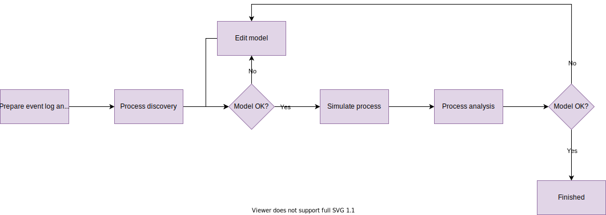
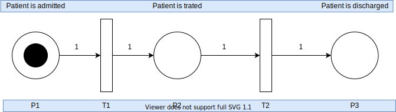
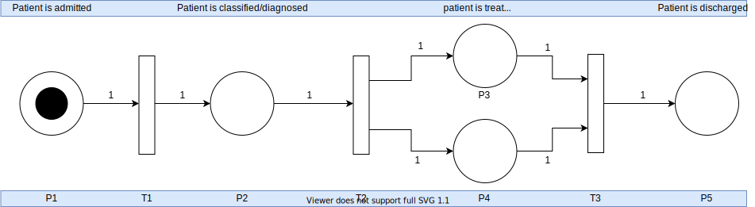

 
**Table of contents**
- [Process reengineering by use of simulation](#process-reengineering-by-use-of-simulation)
  - [Method](#method)
  - [Research questions](#research-questions)
- [Background](#background)
  - [Why (Project usefulness)](#why-project-usefulness)
    - [Yet another tool?](#yet-another-tool)
  - [Process design](#process-design)
    - [Granular process](#granular-process)
    - [Coarse process](#coarse-process)
    - [Fallacy of granular process](#fallacy-of-granular-process)
    - [Fallacy of coarse process](#fallacy-of-coarse-process)
    - [The "sweetspot"](#the-sweetspot)
  - [Aim:](#aim)
    - [Primary Aim](#primary-aim)
    - [Secondary Aim](#secondary-aim)
  - [Tooling](#tooling)
    - [Simulation software](#simulation-software)
      - [ABS](#abs)
      - [Colored Petri-nets (CPN)](#colored-petri-nets-cpn)
    - [Process mining tools](#process-mining-tools)
      - [PRoM](#prom)
      - [PM4PY](#pm4py)
    - [Development tools](#development-tools)
      - [Tool for drawing and editing directed graphs](#tool-for-drawing-and-editing-directed-graphs)
  - [Related works](#related-works)
      - [Background and current trends in process mining](#background-and-current-trends-in-process-mining)
      - [Process simulation and verification](#process-simulation-and-verification)
      - [Process Repair](#process-repair)
  - [Novelty](#novelty)
- [Deliverables](#deliverables)
  - [App](#app)
- [Concepts:](#concepts)
  - [Process mining](#process-mining)
    - [Process log](#process-log)
    - [Process model](#process-model)
    - [Process reengineering](#process-reengineering)
    - [Process discovery](#process-discovery)
    - [Model validation](#model-validation)
    - [Process repair](#process-repair-1)
  - [Petri net](#petri-net)
  - [Simulation](#simulation)
    - [Types](#types)
    - [Techniques](#techniques)
      - [Available Algorithms](#available-algorithms)
      - [Discrete event simulation](#discrete-event-simulation)
  - [Process analysis](#process-analysis)
      - [Performance analysis / quality assessment](#performance-analysis--quality-assessment)
      - [Bottleneck analysis](#bottleneck-analysis)
      - [Key performance indicators (KPI)](#key-performance-indicators-kpi)
      - [Statistical methods](#statistical-methods)
  - [Process mining and formalisms](#process-mining-and-formalisms)
- [Definitions](#definitions)
- [Resources](#resources)

### Current progress and problems
Todos and otherwise are tracked [here](https://github.com/hpl002/Masters_Public/projects/1)

 ----
## Process reengineering by use of simulation
 
**Demonstrate how one can use process mining and model simulation to create more efficient process models by use of a simple web application.** By simulating process flows we can get insights into process performance before they are deployed into real systems, or perform [process repair](#process-repair) on existing models.

The project builds on the concept of [process reengineering](#process-reengineering) as put forth by Prof&#46;dr&#46;ir&#46; Wil van der Aalst, which uses the event log to enhance the process model. It has also taken strong influence from the method and tecniques presented in [Automated simulation and verification of process models discovered by process mining](#automated-simulation-and-verification-of-process-models-discovered-by-process-mining).

"Through simulation experiments various “what if” questions can be answered and redesign alternatives can be compared with respect to key performance indicators." - [Source]((https://dl.acm.org/doi/pdf/10.5555/3275382.3275386))

**The difficulty of process model fitness**  
Designing a process model without taking into account the dynamics of the environment in which it is deployed might lead to unforseen consequences. A process can be understood as a sequence of activities. An activity can be atomic or composed of multiple other activities. These activities often have strict depencencies on resources that are subject to change, such as human capital or machinery. Any change in the availability of one of these resources might lead to unwanted consequences such as delays and complete halts. Alternatively, having abundant resources will prevent the aforementioned, but lead to greater costs for the same throughput, i.e lower efficiencies. 

The ideal process lies within these two outer limits, ensuring the most amount of uptime and the least amount of wastage. This problem is addressed differently depending on how critial the throughput time is. 

By use of model simulation it is possible to finesse the model compositon until it meets the required performance metrics.

The fundamental problem being that we create process models with the expectation that we always have the required resources to execute the modeled activities. In the event where these are not available then there will be delays and halts, and in the event where these are always available then there will be wastage. When processes become large and complex it can become very expensive to keep throwing resources at them to ensure uptime. 

In this project i will address this problem via a web application. More about this [here](#app)

**Main artefact**   

The main artefact of this project will be a web based tool that is used to bridge this gap between process mining and simulation. By making it easy to simulate a given process model we can gather performance metrics and get insights into potential issues before the model is deployed. 

**Problemspace:**  
Rigid and dependale process models are unvaluable tools in critical environments. They allow for strict planning and act as a source of reference for stakeholders and give structure to complex activities. However, they can also lead to inefficiencies and lost profits due to this exact rigidness. 

Having a single process model designed to handle all scenarios is likely impossible. The undeniable trade-off of [granular processes](#granular-process) is that there might exist a scenario where the [process itself becomes counter-productive](#fallacy-of-granular-processes). This can be combated by desinging a process which allows for more flexibility and is more generic, otherwise known as a [coarse process](#coarse-process). However, these also have their [downsides](#fallacy-of-coarse-process)

>This project does not intend to solve the tremendous task of finding the perfect model, but rather provide a [tool](#app) that can be used to aid in the design or repair process models. 

### Method

> A high level overview.   
> The resulting application will be a detailed instance of this exact model.

**Steps:**
1. The event log will have to be prepared by the user. This includes filtering, grouping, and cleaning.
2. The event log is then uploaded.
3. Envent log is transformed to a process model by use of on of the [process discovery algorithms](#process-discovery).
4. The model will then have to be checked for [validity](#model-validation). 
   1. Process discovery will often not yield a perfect model. There might be need to intercept and edit.
   2. There are techniques for both manual and automatic model checking.
6. The resulting model is then simulated by use of one of the [simulation techniques](#simulation).
7. The simulation will yield a new event log. This is then analysed by of appropriate [techniques](#process-analysis).
8. Lastly, the user has to reason over the resulting metrics. If the metrics are not are not as expected then this issue needs to be resolved by altering the model composition. The user jumpts back to step 4.

    
### Research questions
   > Current RQs are subject to change..  
Current draft:  
1. How can simulatons be used to verify the outcome of a process model?  
2. How can simulatons be used to improve a real life process model?  
3. What simulation algorithms exist, and what scenarios are they fit for?    
4. What process discovery algorithms exist, and what scenarios are they fit for?  

## Background
    
### Why (Project usefulness)

**Extract from initial proposal:**

> We can mention one example from treatment of age-related macular degeneration in the eye clinic at Haukeland University Hospital. By analyzing patient data, it was found that in some cases it takes less than 15 minutes to provide the necessary injection, and in other cases it takes as much as 45 minutes. **Based on the data, nurses were trained to handle the easy cases, while specialists handled the more complex cases. It reduced the workload for the specialists, and it was possible to provide services to more patients without compromising the quality.** With this arrangement of training nurses with responsibilities that requires relatively lower competence, it was possible to provide better services at reduced cost, as specialists could do more complex tasks. However, **there is a lack of tool support for this kind of careflow analysis in the hospital, even though it is very important for the management and planning of resources, and to improve the service quality.**

We can simplify this process into the following basic [petri net](#petri-net):

This process could be resolved by adding a two new actions. A classification action where it is determined if the patient is a demanding or a easy case. And secondly a treatment step where the easy cases can be handled. 

 

> Provided that the process has been given a new a path we can expect improvements in the time spent in place P3 and P4. However, we now have to also consider the time spent to diagnose the patient in P2.

#### Yet another tool?
1. Why do we need another tool?
2. find work that details existing tooling
3. what is the problem with the tools that exist
4. what is it that this tool is trying to solve that other tools do not have

### Process design

Process design and modeling is widespread and used in both business and academia. We therefore have techniques and specifications that are unique to their respective domain. In this project i do not focus on a specific notation, but rather [petri nets](#petri-net).  

#### Granular process
*Also known as a narrow process.*  
Process with smaller pieces. Not flexible, but detailed.

#### Coarse process
*Also known as a wide process.*  
Process with many large chunks. Not detailed, but flexible.

#### Fallacy of granular process
*Narrow, detailed, rigid, strict.*  
Process is so granular (detailed) that it allows for no flexibility. This hampers all efficiency the second some unaccounted event occurs. If one single activity stops then this can causes delays in all dependent activities.

 
#### Fallacy of coarse process
*Wide, flexible.*  
Process is so coarse (generic) that it allows for too much flexibility. This leads to unceirtanty and can make the process difficult to follow. Also leads to many altering process flows which then results in poor event logs. Having a ill defined process can have the same results as having no process definition at all.

 
#### The "sweetspot"
A perfect combination of granularity and coarseness is perhaps unobtainable, but the sweetspot is having granularity and flexibility where they are needed. Some activities need to be very detailed, while others rely on there being some flexibility. This knowledge is obtained through domain experience,trial, and error.

### Aim:
The project has two aims, these are:
#### Primary Aim
Create a web based tool that allows for quick and easy simulation of process models in a interative manner.

#### Secondary Aim
Demonstrate how existing process models can be improved by use of the tool.  

Verify or dismiss the effect of the implemented model changes by running accurate simulations on the enhanced models.  

> ...the “Achilles heel of process mining” is the fact that it is backward-looking. Process mining can be used to diagnose problems (e.g., bottlenecks or non-compliance) and predict the paths taken by running process instances (i.e., cases), but it cannot be used to answer “what if” questions and explore radical redesigns. Given the above, it is very natural to combine process mining and simulation.   
> 
> Source: [PROCESS MINING AND SIMULATION: A MATCH MADE IN HEAVEN!](https://dl.acm.org/doi/pdf/10.5555/3275382.3275386)

### Tooling
#### Simulation software

##### ABS
##### Colored Petri-nets (CPN)

#### Process mining tools
##### PRoM
##### PM4PY

#### Development tools
##### Tool for drawing and editing directed graphs
**required features:**  
1. delete nodes
2. add nodes
3. delete paths 
4. add paths
5. add label (weight)
6. replay?  

Options:
   - Graphviz - Graph Visualization Software (as used in "Automated simulation and verification of process models discovered by process mining")
     - !!dont think this has the ability to edit the graph

### Related works
##### Background and current trends in process mining
[Process mining techniques and applications – A systematic mapping study](./resources/09574174.md)
##### Process simulation and verification
[Automated simulation and verification of process models discovered by process mining](./resources/00051144.md)
##### Process Repair
1. [An Approach for Repairing Process ModelsBased on Logic Petri Nets](./resources/21693536.md)
2. [A Profile Clustering Based Event Logs Repairing Approach for Process Mining](./resources/8625568.md)

### Novelty 
> Overlaps with [#yet-another-tool](#yet-another-tool)   

1. issues with current tooling and perhaps academic tooling in general
   1. describe current trends and existent tooling
2. transition from research to production is difficult?
   1. use prom for research and then use what for production?
3. process mining and modularization of software is non-existent
   1. there are some ad-hoc docker images of commonly used applications
4. Does curretly not exist a tool with the described [feature set](#app).  

The general technique describes is not unique. Process mining and simulation is not unique. Creating an app that allows for different methods to be combined is unique.

Automation possibilities? 
 
 

## Deliverables  
### App
**Feature set:**  
- Upload event log and translate this into a process model.
    - Allows for the user to select the process discovery algorithm to be used
  - Upload process model directly
- View the resulting petri net
- Edit the resulting petri net by adding or removing places or transitions
- Run simulation by selecting one of the available simulation methods
- Run process analysis that fetches key performance indicators (KPI)

> The web application is packaged in a easy to use interface that is designed for quick iteration. This again allows us to explore model alternatives with quick succession. While the app does return some performance indicators, it does not try to make intelligent observations about its results. It is the responsibility of the process mining expert and domain experts to reason over the results. 

 
 

## Concepts:

### Process mining
*
Process mining is a growing and promising study area focused on understanding processes and to help
capture the more significant findings during real execution rather than, those methods that, only ob-served idealized process model.* [source](https://www.sciencedirect.com/science/article/pii/S0957417419303161?via%3Dihub)

#### Process log
Zakarija I, Škopljanac-Macina F, Blaškovic B. Discov- ering process model from incomplete log using pro- cess mining. In: 2015 57th International Symposium ELMAR (ELMAR); ÍEEE; 2015. p. 117–120.

#### Process model

Process model is a formal or semi-formal representation of underlying processes behaviour, performance and conformance - [source](van der Aalst WMP. Data science in action. New York, NY: Springer; 2016).

  #### Process reengineering
  *Process Reengineering (PR): improving or extending the model based on event data. Like for conformance checking, both an event log and a process model are used as input. However, now the goal is not to diagnose differences. **The goal is to change the process model.** For example, it is possible to “repair” the model to better reflect reality. **It is also possible to enrich an existing process model with additional perspectives.** For example, replay techniques can be used to show bottlenecks or resource usage. **Process reengineering yields updated models.** These models can be used to improve the actual processes.* - Wil Van der Aalst
  [Source](https://www.researchgate.net/project/Responsible-Event-Driven-Process-Improvement-REDPI)

  #### Process discovery
  write about the different process discovery algos   

inductive machine learning
 - k-tail algo / Biermanns algo  

  Zakarija I, Škopljanac-Macina F, Blaškovic B. Discov- ering process model from incomplete log using pro- cess mining. In: 2015 57th International Symposium ELMAR (ELMAR); ÍEEE; 2015. p. 117–120.

  #### Model validation
  SPIN model checker  
  "Spin model checker is primarily used for formal verifica- tion of distributed systems, such as communication protocols. Spin can run random simulations of the process model or perform a verification of the pro- cess model by exploring all the possible execution paths. To formally describe process models, we use Spin’s Promela language (Process meta language)."

  [42] Holzmann GJ. The SPIN model checker: primer and reference manual. Reading: Addison-Wesley; 2004;vol. 1003

"Model checking is a formal method for software and hardware system verification.Its goal is to check whether a model of a system satisfies given specifi-cation."
  
Researchers have explored various ways for auto-mated checking ofprocess models, e.g. by transforming
the process model finite state automaton to a Petri net
[40,41] that can be dynamically simulated and checked
for problems.

[40]de Medeiros AKA, van der Aalst W, Weijters A. Work- flowmining: current status and future directions. In: On the move to meaningful internet systems 2003: CoopIS, DOA, and ODBASE, volume 2888 of LNCS; Springer- Verlag; 2003. p. 389–406.

[41] van der Aalst WM, Weijters T, Maruster L. Workflow mining: Discovering process models from event logs. IEEE Trans Knowl Data Eng. 2004;16(9):1128–1142.

[16] van der Aalst WMP, Beer HT, Dongen BF. Process min- ing and verification ofproperties: An approach based on temporal logic. In: On the Move to Meaningful Inter- net Systems 2005: CoopIS, DOA, and ODBASE, LNCS; Springer;

  #### Process repair
  Zhang X, Du Y, Qi L, et al. An approach for repairing process models based on logic petri nets. IEEE Access. 2018;6:29926–29939.  
[9] Xu J, Liu J. A profile clustering based event logs repairing approach for process mining. IEEE Access. 2019;7:17872–17881  

### Petri net
A petri net is one of several mathematical modelling languages used for describing distributed systems. Contraty to its more advanced descendants, petri nets are very basic and only model places and transitions.

### Simulation 
 
#### Types
  - discrete event
  - continious 
  - parallel discrete event

#### Techniques
 - Spin model checker 
 - Abstract Behavioural Specification Language
 - PM4PY
##### Available Algorithms
  - Playout of a Petri Net
  - Monte Carlo Simulation
  - CTMC Simulation (DFG)
  - Extensive Playout of a Process Tree

TODO: 
- simulation algorithms
  - PM4PY

##### Discrete event simulation
  "... models the operation of a system as a discrete sequence of events in time. Each event occurs at a particular instant in time and marks a change of state in the sytem. Between the consecustive events, no change in the system is assumed to occur; thus the simulation can directly jump tot teh " - [source](https://en.wikipedia.org/wiki/Discrete-event_simulation)

 
### Process analysis
##### Performance analysis / quality assessment  
De Weerdt J, De Backer M, Vanthienen J, et al. Amulti- dimensional quality assessment of state-of-the-art pro- cess discovery algorithms using real-life event logs. Inf Syst. 2012;37(7):654–676
##### Bottleneck analysis
##### Key performance indicators (KPI)
##### Statistical methods

### Process mining and formalisms  
Elgammal A, Turetken O, van den Heuvel W-J, et al. Formalizing and applying compliance patterns for business process compliance. Software Syst Model. 2016;15(1):119–146.

 
## Definitions  
**Bottom-up process redesign**
Redesigning some process by looking at process data 

**Top-down process redesign**
Redesigning some process by looking at process documentation            

## Resources
**Literature:**
1. [PROCESS MINING AND SIMULATION: A MATCH MADE IN HEAVEN!](https://dl.acm.org/doi/pdf/10.5555/3275382.3275386)  
2. [A Generic Framework for Context-AwareProcess Performance Analysis](https://www.researchgate.net/publication/309228794_A_Generic_Framework_for_Context-Aware_Process_Performance_Analysis)  
   
**Other:**  
1. [ProcessMining.org](<https://[github.com/camunda](http://processmining.org/)>)  
2. [PM4PY](https://pm4py.fit.fraunhofer.de/)  
3. [BPMN Miner](https://github.com/hpl002/BPMN-Miner)

 

 