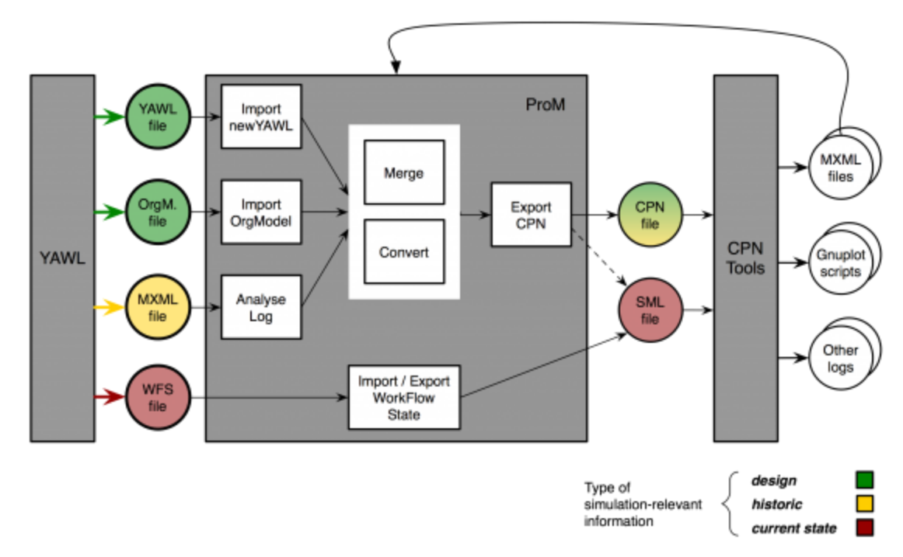

 
**Table of contents**
- [Process reengineering by use of simulation](#process-reengineering-by-use-of-simulation)
  - [Contributions](#contributions)
  - [Paper structure](#paper-structure)
- [Background](#background)
  - [Process mining](#process-mining)
    - [Manifesto](#manifesto)
  - [Process design](#process-design)
  - [Process analysis](#process-analysis)
  - [Simulation](#simulation)
  - [Tooling](#tooling)
    - [Simulation tools](#simulation-tools)
    - [Process mining tools](#process-mining-tools)
    - [Development tools](#development-tools)
- [Method](#method)
  - [Aim:](#aim)
  - [Research questions](#research-questions)
  - [Novelty](#novelty)
  - [Why (Project usefulness)](#why-project-usefulness)
  - [Deliverables](#deliverables)
    - [App](#app)
- [Concepts:](#concepts)
  - [L* life-cycle](#l-life-cycle)
  - [Process log](#process-log)
  - [Process model](#process-model)
  - [Directly-follows graph (DFG)](#directly-follows-graph-dfg)
    - [Process reengineering](#process-reengineering)
  - [Process discovery](#process-discovery)
  - [Model validation](#model-validation)
  - [Process repair](#process-repair)
  - [Petri net](#petri-net)
  - [Colored petri net(CPN)](#colored-petri-netcpn)
      - [Bottleneck analysis](#bottleneck-analysis)
      - [Key performance indicators(KPI)](#key-performance-indicatorskpi)
      - [Statistical methods](#statistical-methods)
- [Definitions](#definitions)
- [Resources](#resources)

### Current progress and problems
Todos and otherwise are tracked [here](https://github.com/hpl002/Masters_Public/projects/1)

### Disclaimer
This document is simply a structured collection of notes and resources that is intended to be used as a reference when writing the more complete document. Please excuse any erorrs or inconsistencies

 ----
## Process reengineering by use of simulation
 
**Demonstrate how one can use process mining and model simulation to enhance process models by use of a simple web application, while also proposing an alternative application architecture.** By running simulations on the generated process model we are able generate new event logs which can then be analyzed for [key performance indicators](#key-performance-indicators-kpi). The application is based on the concepts of containerization and addresses some critiques of current tooling.

These KPI metrics are used to indicate if a process is in need of improvement. The tool serves two primary purposes:
1. used to conduct process enhancement
2. used to test the impact of some model alteration

This is accomplished by combining methods from process discovery, conformance, and enhancement. These are combined in a modular fashion which allows the user to combine different techniques from these main areas. 

The tool also supports direct alteration of the generated process model, meaning that the user can add or delete nodes at will, and then have this model simulated.

While there exits tools that cover each of these aspects individually, there are none that combined them in a single application. Performing simulation in popular tools such as PRoM forces the user to conduct part of the analysis in PRoM and run the simulaton in CPN Tools. This forces the user to jump between applications and juggle different files. This workflow can be improved by combining techniques in a single application.

The tool also addresses the poor interoperability concern of PRoM by containerizing the entire application and submodules in docker containers. While PRoM is platform independent, it is not technology independent. The aim being that it should be easy to introduce and combine new techniques into the process mining ecosystem, not matter what language or technology it is built on.

### Contributions  
The project therefore has three contributions:
1. Demonstrate how process mining and simulation can be combined by exploring practical examples.
   - There exists works that explore these two topics, but few that detail the entire workflow. The aim is to provide a clear and accurate description of how one could conduct this and why the different workflow steps are important. This is missing from litterature.
   - Demonstrate usefullness via examples.
   - Current literature often demands that the user is well versed in process mining and process engineering. This paper addresses these concepts from the outset that the reader has little to no prior knowledge.
2. Showcase an alternative method of structuring future process mining applications. While PRoM is undoubtedly the de facto application for conducting process mining, it is not without faults. This project aims to address some of these critiques.
3. Provide a tool for conducting process mining and subsequent simulation in a single application. Current approaches demand that you jump between different applications and juggle files. This workflow can be improved.

**Tags**
Tags and keywords:  
1. Process mining
2. process simulation
3. process enhancement
4. process mining tooling

The project builds on the concept of [process reengineering](#process-reengineering) as put forth by Prof&#46;dr&#46;ir&#46; Wil van der Aalst, which uses the event log to enhance the process model. It has also taken strong influence from the method and techniques presented in several key papers that explore the intersection of process mining and simulation. 

Process mining and simulation is highly relevant for those who are conducting business process redesign.

"Through simulation experiments various “what if” questions can be answered and redesign alternatives can be compared with respect to key performance indicators." - [Process mining and simulation: A match made in heaven!](./resources/literature/p1002(1).pdf)

**The difficulty of process model fitness**  
TODO: find definition and reference of model fitness from conformance paper.  
Designing a process model without taking into account the dynamics of the environment in which it is deployed might lead to unforseen consequences. A process can be understood as a sequence of activities. An activity can be atomic or composed of multiple other activities. These activities often have strict depencencies on resources that are subject to change, such as human capital or machinery. Any change in the availability of one of these resources might lead to unwanted consequences such as delays and complete halts. Alternatively, having abundant resources will prevent the aforementioned, but lead to greater costs for the same throughput, i.e lower efficiencies. 

The ideal process lies within these two outer limits, ensuring the most amount of uptime and the least amount of wastage. This problem is addressed differently depending on how critial the throughput time is. 

By use of model simulation it is possible to finesse the model compositon until it meets the required performance metrics.

The fundamental problem being that we create process models with the expectation that we always have the required resources to execute the modeled activities. In the event where these are not available then there will be delays and halts, and in the event where these are always available then there will be wastage. When processes become large and complex it can become very expensive to keep throwing resources at them to ensure uptime. 

In this project i will address this problem via a web application. More about this [here](#app)

**Main artefact**   

The main artefact of this project will be a web based tool that is used to bridge this gap between process mining and simulation. By making it easy to simulate a given process model we can gather performance metrics and get insights into potential issues before the model is deployed. 

**Problemspace:**  
Rigid and dependale process models are unvaluable tools in critical environments. They allow for strict planning and act as a source of reference for stakeholders and give structure to complex activities. However, they can also lead to inefficiencies and lost profits due to this exact rigidness. 

Having a single process model designed to handle all scenarios is likely impossible. The undeniable trade-off of [granular processes](#granular-process) is that there might exist a scenario where the [process itself becomes counter-productive](#fallacy-of-granular-processes). This can be combated by desinging a process which allows for more flexibility and is more generic, otherwise known as a [coarse process](#coarse-process). However, these also have their [downsides](#fallacy-of-coarse-process)

>This project does not intend to solve the tremendous task of finding the perfect model, but rather provide a [tool](#app) that can be used to aid in the design or repair of process models. 

### Paper structure
Initially i will present a detailing of necessary background on the concepts of process mining, simulation, and tooling. Thereafter i will present the process mining method, my own method, research questions, and project novelty. The final section contains a list of concepts and resoruces that are referenced throughout the paper.

## Background
> A detailing of fundamental concepts and ideas.   
> Other areas and concepts that are more secondary are detailed in the [concepts section](#concepts).  

### Process mining
>The idea of process mining is to discover, monitor and improve real processes (i.e., not assumed processes) by extracting knowledge from event logs readily available in today’s (information) systems - [Manifesto](./resources/literature/2012_Book_.pdf)  

Process mining is a still a very new research field. Initially conceived by Prof&#46;dr&#46;ir&#46; Wil van der Aalst and with its earliest publications dating to the 1990s. The official date is perhaps 2009, as this was when the Task Force on Process Mining was originaly founded. The task force published a [process mining manifesto](./resources/literature/2012_Book_.pdf) in 2011 that detailed the state of the art at the time of publishing. Prof&#46;dr&#46;ir&#46; Wil van der Aalst has an extensive reputation and has either published, coauthored, or edited almost 900 works on the topics of process mining, petri nets, business process management, workflow managmeent, process modeling, and process analysis. He is with no exception considered the *godfater* of process mining. - [source](http://www.padsweb.rwth-aachen.de/wvdaalst/)

The published manifesto is therefore a good starting point for interested parties as it is published by and with the help of the most reputable sources in the field. It details its intentions, core concepts, the appointed task force, and core issues. 

#### Manifesto 
[Manifesto](./resources/literature/2012_Book_.pdf)  
*A manifesto is a public declaration of principles and intentions*  [Manifesto](./resources/literature/2012_Book_.pdf)
Process mining is a set of techniques used for extracting knowledge from event logs. Such logs are produced by modern infromation systems. Process mining technoques are intended to be used as a means to *discover, monitor, and improve processes in a variety of application domains*[Manifesto](./resources/literature/2012_Book_.pdf). The main forces behind the increased interest and relevance is data abundance and complexity. More and more data is being produced, and more complex systems are being developed. 

*Process mining is a relatively young research discipline that sits between computational intelligence and data mining on the one hand, and process modeling and analysis on the other hand. **The idea of process mining is to discover, monitor and improve real processes (i.e., not assumed processes) by extracting knowledge from event logs readily available in today’s (information) systems***

Process mining is composed of a series of smaller activities which all address different needs and purposes. Some activities are atomic, while others have strict dependencies on other activities. The main activities and their relevanve for this project are:
1. process discovery (Relevant)
2. conformance checking (Relevant)
3. simulation models (Relevant)
4. model extension (Relevant)
5. model repair (Relevant)
6. social network/organizational mining
7. case prediction
8. history-based recommendations

Process mining is perhaps best understood as an enabler of other well known business intelligence(BI) activities. Within BI we have for example:
1. Business Acivity Monitoring
2. Complex Event Processing
3. Corporate Performance Management
4. Continious Process Improvement
5. Business Process Improvement
6. Total Quality Management
7. Sig sigma 

##### Event logs <!-- omit in toc -->
For all intents and purposes, a process can be understood as a complex set of activities and relations. A case can be understood as a process instance that has traversed a particulat path of the desribed process. A process can have many paths, but a case can only traverse one. This traversal is recorded in event logs. An event log is a collection of occurances. These occurances or entries can be described using any number of fields, but process mining mandates that each entry has a trace identifier, activity identifier, and timestamp. A case can therefore be understood as a series of sequential occurances, and a process log most commonly contains multiples of these traces.

> Figure from [Manifesto](./resources/literature/2012_Book_.pdf) that show the three main activities of process mining.
Process discovery takes an event log as input and produces some process model. The model can be any number of formats, but most commonly as a petri net. Conformance checking takes an event log and process model as input and produces diagnostics. Most commonly used check if the event log aligns with some pre-existing process model. Can for example be used to locate traces that perform some actions that the underlying process does not support. Activitie that do not follow the proposed model can be an indicator of many things. The process model might be too generic and does not map reality, or be too strict and inaccurate and therfore forces alternate activities, and so forth. Lastly, process enhancement is about extending or improving some existing process model using information from the process event log and a process model. Enhancement through simulation falls within this last activity. The simulation approch is particularly interested in answering that which is coined "what if" question, such as: 
1. what happends if i restucture the process in *this* manner
2. what happends if a run a simulation that describes *this* scenario
3. what happend if i alter the resource capacity if *this* activity and run *this* simulation scenario
  
The relevance of simulation for process mining will be detailed in the following [simulation ](#simulation) section.  
 ##### Perspectives <!-- omit in toc -->
Literature often describes the mining of different *perspectives*. The notion of perspectives is intended to highlight a focus area. For example, the *control flow perspective* is interested in the ordering of activities and intends to find a good characterization of all possible paths. The *organizational perspective* focuses on information about resources hidden in the log, e.g what people, systems, roles, or departments are involved, to what extent, and how these relate each other. The *time perspective* focuses on the timing and frequency of events. It should also be noted that when an event has a timestamp, it is possible to discover bottlenecks, measure service levels, monitor the utilization or resources, and predict the remaining processing time of runnin cases.

##### Lifecycle of process mining project <!-- omit in toc -->

> Figure from [Manifesto](./resources/literature/2012_Book_.pdf) that show the traditional lifecycle of a process mining project.
*[The L* life-cycle](#l-life-cycle)* describes the core steps in a traditional process mining project. As seen in figure above, it consists of five steps, these are.
0. Step 0: Plan and justify
- here we might answer fundamental questions about the project aim, purpose, success criteria, etc.
1. Step 1: Extract
- At this stage we need to extract different types of data from the involved parties, such as the information system, stakeholders, domain experts, questions, models, and objectives. Requires an understanding of the available data and which parts are suitable for analysis. It required domain knowledge to have a understanding of fundamental and important questions. This step results in a different artefacts, such as handmand data, models, objectives or KPIs, and questions.
2. Step 2: Create control-flow model and connect event log  
- The control flow modle is constructed and linked to the event log. The control flow model can be generated via one of the available [process discovery methods](#process-discovery). 
3. Step 3: Create integrated process model
- Once the process is relatively structured, the control-flow model may be extended with other perspectives, such as data, time, adn resources.
- The relation between the event log and the model created in stag 2 is used to extend the model. 
4. Step 4: Operational support
- The models created in stage 3 may be used for operational support.
- Knowledge extracted from historical event data is combined with information about running cases. This again can be used to intervene, predict, and recommend. 
- > * Staged 3 and 4 can only be reacehd if the process is sufficiently stable and structured
  
More about the L* life-cycle can be found [here](#l-life-cycle). 

-----

The main goal of process mining is to process event data and other process related information in a manner that allows for further resoning and extraction. In process mining this is primarily done via [process discovery](#process-discovery), which generates a process model from an [event log or process log](#process-log). 

> *Process mining is a growing and promising study area focused on understanding processes and to help
capture the more significant findings during real execution rather than, those methods that, only observed idealized process model.* - [Process mining techniques and applications – A systematic mapping study](./resources/literature/1-s2.0-S0957417419303161-main.pdf)

Generally we can describe process mining based on its three main activities : [process discovery](#process-discovery), [process conformance](#process-conformance), and [process enhancement](#process-enhancement).

> Figure that showcases the main areas areas of process mining, and subsequent sub-interests. 
> [Process mining techniques and applications – A systematic mapping study](./resources/literature/1-s2.0-S0957417419303161-main.pdf)
    
 
### Process design

Process design and modeling is widespread and used in both business and academia. We therefore have techniques and specifications that are unique to their respective domain. In this project i do not focus on a specific notation, but rather [petri nets](#petri-net).  

#### Granular process <!-- omit in toc -->
*Also known as a narrow process.*  
Process with smaller pieces. Not flexible, but detailed.

#### Coarse process <!-- omit in toc -->
*Also known as a wide process.*  
Process with many large chunks. Not detailed, but flexible.

#### Fallacy of granular process <!-- omit in toc -->
*Narrow, detailed, rigid, strict.*  
Process is so granular (detailed) that it allows for no flexibility. This hampers all efficiency the second some unaccounted event occurs. If one single activity stops then this can causes delays in all dependent activities.

#### Fallacy of coarse process <!-- omit in toc -->
*Wide, flexible.*  
Process is so coarse (generic) that it allows for too much flexibility. This leads to unceirtanty and can make the process difficult to follow. Also leads to many altering process flows which then results in poor event logs. Having a ill defined process can have the same results as having no process definition at all.
 
#### The "sweetspot" <!-- omit in toc -->
A perfect combination of granularity and coarseness is perhaps unobtainable, but the sweetspot is having granularity and flexibility where they are needed. Some activities need to be very detailed, while others rely on there being some flexibility. This knowledge is obtained through domain experience,trial, and error.

### Process analysis
##### Performance analysis / quality assessment  <!-- omit in toc -->
[A multi-dimensional quality assessment of state-of-the-art processdiscovery algorithms using real-life event logs](./resources/literature/1-s2.0-S0306437912000464-main.pdf)

Having poor process quality metrics is indicative of a process model that needs repair. There are two models in this setting. The "original" and governing model of the actual process. This model might not be available or exist at all. Then theres the process model which is generated through process discovery. 

Poor metrics can be indicative of multiple scenarios.
1. the generated process model is of poor quality
2. the generated process model is actually accurate, it is the underlying process which is poor

How can we determine where the project lies? With the underlying model or the generated model?

**process model quality metrics**:  
The metrics are tightly coupled.  
*Some metrics have been proposed to determine the quality
of a process model, such as fitness, simplicity, precision
and generalization*

Process Conformance is the type of process mining responsible
to measure the quality of a process model.

The quality of a process
model is usually described considering the four quality dimensions
( van der Aalst, 2016 ):
• Fitness: ability to observe the event log behavior in the discov-ered model;
• Precision: quality to avoid behavior unrelated to the used event
log in the discovery process, like avoiding underfitting concept;
• Generalization: capacity to accept new similar events related to
previous events used for discovering, like avoiding overfitting
concept; and
• Simplicity: quality to be as simple as possible.

Nominal work on process quality metrics:
[Process Mining: Discovery, Conformance and Enhancement of Business Processes](./resources/literature/2011_Book_ProcessMining.pdf)

1. model fitness 
   1. used to ensure the occurence of behaviors in event logs. Fitness is considered good if the process model supports the events in the process log. Poor if it does not support it. This can presumably be measured
2. model precision
   1. process model does not allows for unobserved activities. Does not allow for activities that are not observed in an event log. 
   2. Generalization claims that a process model is able to reproduce future activities.  
3. model simplicity
   1. requires that a process model with a simple structure can execute the behaviours in the event logs. 
   2. The simpler the model the better, i pressume..

### Simulation 
 
Process mining is about extracting knowledge from the logs of real world processes. These logs describe event occurances and typically have fields such as timestamps for event start and stop, event identifier, trace identifier, and event name. This allows us to discover complex process models through process discovery. These resulting models can then describe the traces or paths that exist in the log. We can therefore describe a process log as a collection of traces that all contain discrete event occurances. A single trace is a series of discrete events. The concept of discrete events can be described with the analogy of a queue of people waiting to be served by a single teller at a bank. The teller can only serve a single customer at a time and the 

 what about async events?
 can a person perform two actions at the same time? wash clothes and dry clothes ?  

Some processes will allow for multiples of the same event to occur at the same time. While these occurances are similar they can be distinguished by their trace identifier. 

TODO: 
1. Have yet to find a work that details how the simulation model is actually executen in CPN tools. Is it both a declaration and instruction?

By means of discrete event simulation, the performance of systems can be evaluated, alternative configurations of a system can be compared, and an optimal configuration of a system can be found  

[A process-oriented methodology for evaluating the impact of IT: A proposal and an application in healthcare](./resources/literature/1-s2.0-S0306437913000951-main.pdf)

 
#### Types <!-- omit in toc -->
  - discrete event
  - continious 
  - parallel discrete event

#### Techniques <!-- omit in toc -->
 - Spin model checker 
 - Abstract Behavioural Specification Language
 - PM4PY
##### Available Algorithms <!-- omit in toc -->
  - Playout of a Petri Net
  - Monte Carlo Simulation
  - CTMC Simulation (DFG)
  - Extensive Playout of a Process Tree

TODO: 
- simulation algorithms
  - PM4PY

##### Discrete event simulation <!-- omit in toc -->
  "... models the operation of a system as a discrete sequence of events in time. Each event occurs at a particular instant in time and marks a change of state in the sytem. Between the consecustive events, no change in the system is assumed to occur; thus the simulation can directly jump tot teh " - [source](https://en.wikipedia.org/wiki/Discrete-event_simulation)

numerous studies can be found report-ing on the successful application of discrete-event simulation in order to improve efficiency and reduce costs.

Good overviews of literature have been provided by Jun et al. [17], England et al. [18], and Yang et al. [19].

With regard to healthcare clinics, Jun et al. [17] mention three different areas that impact patients in clinics. These are patient scheduling and admissions, patient routing and flow schemes, and scheduling and availability of resources.

17. [Application of Discrete-Event Simulation in Health Care Clinics: A Survey](./resources/literature/1999JoftheOperationalResearchSociety.pdf)

18. [TUTORIAL ON THE SIMULATION OF HEALTHCARE SYSTEMS](./resources/literature/2431518.2431686.pdf)

19. [Applications of Computer Simulation in Medical Scheduling](./resources/literature/Applications_of_Computer_Simulation_in_Medical_Sch.pdf)

 
However, despite the abundance of literature that exists on simulation and its application, there is hardly any literature on the intersection of process mining and discrete-event simulation.

[Discovering simulation models](./resources/literature/discsim_is.pdf)

### Tooling

In the last decade, many tools have emerged to support process
mining. However, the majority of publications use the ProM frame- work, 6 a very powerful and open source framework ( van Don- gen, de Medeiros, Verbeek, Weijters, & van der Aalst, 2005 ). ProM offers a pluggable architecture and is one reason why research communities embrace this framework. ProM allows flexibility in developing new algorithm (plug-ins), extending and combining them with standardized input and output formats. However, there are other options, such as Aris Process Performance Manager from Software AG, 7 BAB Framework 8 (Best Analytics of Big Data), Celo- nis Discovery, 9 Disco from Fluxicon, 10 Myivenio from Cognitive Technology, 11 Perceptive Process Mining from Lexmark (acquired by Hyland Software 12 and previously started by Pallas Athena as FLOWer)), Process Gold, 13 QPR ProcessAnalyzer, RapidProM, 14 SNP Business Process Analysis, 15 Signavio Process Intelligence, 16 Up- Flux, 17 and others.

6 http://www.promtools.org . 7 https://www.softwareag.com/ . 8 https://www.babcloud.org . 9 https://www.celonis.com/ .
10 http://www.fluxicon.com/disco . 11 https://www.my-invenio.com/ . 12 https://www.hyland.com/ . 13 http://processgold.com . 14 http://www.rapidprom.org/ . 15 https://www.snp-ag.com/ . 16 https://processmining.signavio.com/ . 17

 - from [Process mining techniques and applications – A systematic mapping study](./resources/literature/1-s2.0-S0957417419303161-main.pdf)

An approach to acquire, exchange, and analyze event logs was pro-posed, and this standard is called Extensible Event Stream (XES)
( Xes, 2016 ).

#### Simulation tools
This section will detail some popular tool choices and their underlying techniques.

##### Process Mining 4 Python(PM4PY) <!-- omit in toc -->
Python library composes of a series of methods relevant to process mining. The library has 9 main categories: 
1. Handling event data
2. Filtering event data
3. Process discovery
4. Petri net management
5. Conformance checking
6. Statistics
7. Evaluation
8. Simulation
9. Social network analysis

This will utilize this tooling for different purposes, such as process discover, conformance checking, process analysis, and possibly simulation.
The library offers three simulation algorithms:
1. Playout of a Petri Net
   "Takes as input a Petri net with initial markings, and returns a list of process executions that are allowed from the process model"  
   We can get back a specified number of process executions, up to a number.  
   Returns all the executions that are possible according to the model, up to a provided length of trace (may be computationally expensive)  
   **This method might be useful if the aim is to collect a set of all unique process executions.**
2. Monte carlo simulation
   "A time-related simulation permits to know how probable is that a process execution is terminated after a given amount of time."  
   Leads to better identification of the process instances that are most likely to have high throughput time.
   Requires a DFG model, and knowledge of the case arrival ratio.
   **This method might be useful if the aim is to determine how probable it is that a process will finish within X days**
3. Continuous Time Markov Chain(CTMC) Simulation(DFG)
   "A time-related simulation permits to know how probable is that a process execution is terminated after a given amount of time."
   Requires a DFG model.
   **This method might be useful if the aim is to determine how probable it is that a process will finish within X days**
4. Extentive playout of a process tree
   "An extensive playout operation permits to obtain (up to the provided limits) the entire language of the process model."

##### Colored Petri-nets(CPN) & CPN Tools <!-- omit in toc -->
The most cited and used simulation technique in combination with PRoM. Given that PRoM is the de facto standard for process mining, it comes as no surprise that CPN tools follows suit, as PRoM has plugings for exporting to CPN.

##### ABS <!-- omit in toc -->

#### Process mining tools
##### PRoM <!-- omit in toc -->
Fundamental criticism.  
There are likely opinionated works that comment on this.  

What is the basic workflow in PRoM  
How are methods and techniques combined?  
Prom does not have a public facing library or package manager. Why are they hoarding?  

**conducting simulation in Prom:**  
Discovering simulation model: 
  
source: http://www.processmining.org/prom/miningcpntutorial

Workflow Simulation Models:
    
source: http://www.processmining.org/yawltutorial

##### PM4PY <!-- omit in toc -->

##### docker <!-- omit in toc -->
tiny images: https://github.com/iron-io/dockers  

#### Development tools
##### Tool for drawing and editing directed graphs <!-- omit in toc -->
**required features:**  
1. delete nodes
2. add nodes
3. delete paths 
4. add paths
5. add label (weight)
6. replay?  

Options:
   - Graphviz - Graph Visualization Software (as used in "Automated simulation and verification of process models discovered by process mining")
     - !!dont think this has the ability to edit the graph
     - 
 
## Method

### Aim:
The project has two aims, these are:
#### Primary Aim <!-- omit in toc -->
Create a web based tool that allows for quick and easy simulation of process models in a interative manner.

#### Secondary Aim <!-- omit in toc -->
Demonstrate how existing process models can be improved by use of the tool.  

Verify or dismiss the effect of the implemented model changes by running accurate simulations on the enhanced models.  

> ...the “Achilles heel of process mining” is the fact that it is backward-looking. Process mining can be used to diagnose problems (e.g., bottlenecks or non-compliance) and predict the paths taken by running process instances (i.e., cases), but it cannot be used to answer “what if” questions and explore radical redesigns. Given the above, it is very natural to combine process mining and simulation.   
> 
> Source: [Process mining and simulation: A match made in heaven!](./resources/literature/p1002(1).pdf)

> A high level overview.   
> The resulting application will be a detailed instance of this exact model.

**Steps:**
1. The event log will have to be prepared by the user. This includes filtering, grouping, and cleaning.
2. The event log is then uploaded.
3. Envent log is transformed to a process model by use of on of the [process discovery algorithms](#process-discovery).
4. The model will then have to be checked for [validity](#model-validation). 
   1. Process discovery will often not yield a perfect model. There might be need to intercept and edit.
   2. There are techniques for both manual and automatic model checking.
6. The resulting model is then simulated by use of one of the [simulation techniques](#simulation).
7. The simulation will yield a new event log. This is then analysed by of appropriate [techniques](#process-analysis).
8. Lastly, the user has to reason over the resulting metrics. If the metrics are not are not as expected then this issue needs to be resolved by altering the model composition. The user jumpts back to step 4.

    
### Research questions
   > Current RQs are subject to change..  
Current draft:  
1. How can simulatons be used to verify the outcome of a process model?  
2. How can simulatons be used to improve a real life process model?  
3. What simulation algorithms exist, and what scenarios are they fit for?    
4. How can one use existing tools to conduct process mining and simulation, what workflows exist and what tools are popular?
   1. How well does this work?
   2. How can it be improved?

### Novelty 
> Overlaps with [#yet-another-tool](#yet-another-tool)   

1. issues with current tooling and perhaps academic tooling in general
   1. describe current trends and existent tooling
   2. by creating a web based tool that uses async http requests in the process we are also making it easier for new developers and researchers to introduce their techniques into this process flow
      1. say you have a new model checking technique then you can simply craete a dockerized application of it and substitute your method instead of using the default
2. transition from research to production is difficult?
   1. use prom for research and then use what for production?
3. process mining and modularization of software is non-existent
   1. there are some ad-hoc docker images of commonly used applications
4. Does curretly not exist a tool with the described [feature set](#app).  

The general technique describes is not unique. Process mining and simulation is not unique. Creating an app that allows for different methods to be combined is unique.

Automation possibilities? 

### Why (Project usefulness)

**Extract from initial proposal:**

> We can mention one example from treatment of age-related macular degeneration in the eye clinic at Haukeland University Hospital. By analyzing patient data, it was found that in some cases it takes less than 15 minutes to provide the necessary injection, and in other cases it takes as much as 45 minutes. **Based on the data, nurses were trained to handle the easy cases, while specialists handled the more complex cases. It reduced the workload for the specialists, and it was possible to provide services to more patients without compromising the quality.** With this arrangement of training nurses with responsibilities that requires relatively lower competence, it was possible to provide better services at reduced cost, as specialists could do more complex tasks. However, **there is a lack of tool support for this kind of careflow analysis in the hospital, even though it is very important for the management and planning of resources, and to improve the service quality.**

We can simplify this process into the following basic [petri net](#petri-net):

This process could be resolved by adding a two new actions. A classification action where it is determined if the patient is a demanding or a easy case. And secondly a treatment step where the easy cases can be handled. 

 

> Provided that the process has been given a new a path we can expect improvements in the time spent in place P3 and P4. However, we now have to also consider the time spent to diagnose the patient in P2.

TODO: reference process mining and simulation paper, a match made in heaven for the usefullness and promise of combining these two techniques.

#### Yet another tool? <!-- omit in toc -->
1. Why do we need another tool?
2. find work that details existing tooling
3. what is the problem with the tools that exist
4. what is it that this tool is trying to solve that other tools do not have

 
 

### Deliverables  
#### App
**Feature set:**  
- Upload event log and translate this into a process model.
    - Allows for the user to select the process discovery algorithm to be used
  - Upload process model directly
- View the resulting petri net
- Edit the resulting petri net by adding or removing places or transitions
- Run simulation by selecting one of the available simulation methods
- Run process analysis that fetches key performance indicators (KPI)

> The web application is packaged in a easy to use interface that is designed for quick iteration. This again allows us to explore model alternatives with quick succession. While the app does return some performance indicators, it does not try to make intelligent observations about its results. It is the responsibility of the process mining expert and domain experts to reason over the results. 

## Concepts:
 
### L* life-cycle
A well know paper published by van der Aalst (2011) proposed the L ∗ life-cycle model consisting of five phases for conducting a process mining application.

- Plan and justify phase-focus is data-driven to explore and answer curiosities and gain insights; or, question-driven focused on explaining a specific situation e.g., why determined issues occur; or, goal-driven focused on improving the KPI, response time performance, explain deviations, reduce costs.
- Extract-explore the knowledge system data domain for recover- ing relevant events. Sometimes it can be very time-consuming owing to system complexity, e.g., with thousands of repositories spread among many tables.
- Discover a process model based on event logs-process miner algorithms are used to obtain a process model. When an un- derstandable model is acquired, it is possible to start confor- mance checks, analyzing activities and deviations to the discov- ered process model.
- Create integrated process model-enhancements and added in- formation are integrated in the model, promoting new perspec- tives related to time replayed, organization, resource utilization, case comparisons, and simulation, among other possibilities.
- Operational support-involves detecting, predicting, and recom- mending. This is the most advanced level of computational sup- port, for example, the process mining tool should be capable to alert (email) on deviation cases, provide advice about bottle- necks, recommend resource setup or reallocation, etc

### Process log
Zakarija I, Škopljanac-Macina F, Blaškovic B. Discov- ering process model from incomplete log using pro- cess mining. In: 2015 57th International Symposium ELMAR (ELMAR); ÍEEE; 2015. p. 117–120.

### Process model

Process model is a formal or semi-formal representation of underlying processes behaviour, performance and conformance - [source](van der Aalst WMP. Data science in action. New York, NY: Springer; 2016).

### Directly-follows graph (DFG)
[A practitioner's guide to process mining: Limitations of the directly-follows graph](./resources/literature/dfg.pdf)

#### Process reengineering
*Process Reengineering (PR): improving or extending the model based on event data. Like for conformance checking, both an event log and a process model are used as input. However, now the goal is not to diagnose differences. **The goal is to change the process model.** For example, it is possible to “repair” the model to better reflect reality. **It is also possible to enrich an existing process model with additional perspectives.** For example, replay techniques can be used to show bottlenecks or resource usage. **Process reengineering yields updated models.** These models can be used to improve the actual processes.* - Wil Van der Aalst
[Source](https://www.researchgate.net/project/Responsible-Event-Driven-Process-Improvement-REDPI)

  ### Process discovery
  The process discovery algorithm is responsible to generate a process model based on any a-priori information, such as an event log ( van der Aalst, 2016 ).

  write about the different process discovery algos:  
  alpha algorithm, heuristic mining, multiphase mining, fuzzy mining, genetic mining, region miner, integer linear programming (ILP) miner, declarative miner, etc.

  This discovery process should deliver a model with quality, where it is expected to be comprehensible by avoiding unnecessary complexity, and deliver acceptable accuracy, balancing recall, precision, and generalization ( Weerdt et al., 2012 ).

The result of a process discovery algorithm can be evaluated considering four quality dimensions can be characterized: fitness, simplicity, precision, and generalization ( van der Aalst, 2016 );

  

inductive machine learning
 - k-tail algo / Biermanns algo  

  Zakarija I, Škopljanac-Macina F, Blaškovic B. Discov- ering process model from incomplete log using pro- cess mining. In: 2015 57th International Symposium ELMAR (ELMAR); ÍEEE; 2015. p. 117–120.

  ### Model validation
  SPIN model checker  
  "Spin model checker is primarily used for formal verifica- tion of distributed systems, such as communication protocols. Spin can run random simulations of the process model or perform a verification of the pro- cess model by exploring all the possible execution paths. To formally describe process models, we use Spin’s Promela language (Process meta language)."

[Spin Model Checker, The: Primer and Reference Manual](./resources/literature/spinPrimer.pdf)

 
"Model checking is a formal method for software and hardware system verification.Its goal is to check whether a model of a system satisfies given specifi-cation."
  
[Workflow mining: Discovering process models from event logs](./resources/literature/01316839.pdf)

[Process Mining and Verification of Properties: An Approach Based on Temporal Logic](./resources/literature/2005_Book_OnTheMoveToMeaningfulInternetS.pdf)

> figure taken from [here](#process-mining-techniques-and-applications--a-systematic-mapping-study)

  ### Process repair
  Process repair is primarily conserned with the repairing of the model that is generated through model discovery.  
  [An Approach for Repairing Process Models Based on Logic Petri Nets](.resources/literature/08370624.pdf)  
  [A Profile Clustering Based Event Logs Repairing Approach for Process Mining](./resources/literature/08625568(2).pdf)

### Petri net
A petri net is one of several mathematical modelling languages used for describing distributed systems. Contraty to its more advanced descendants, petri nets are very basic and only model places and transitions.

### Colored petri net(CPN)
Source: [A brief introduction to Coloured Petri Nets](./resources/literature/Jensen1997_Chapter_ABriefIntroductionToColouredPe.pdf)
CPN is a graphical oriented language for design, specification, simulation and verification of systems. Typical examples of application areas are communication protocols, distributed systems, imbedded systems, autoamted production systems, **workflow analysis** and VLSI chips. Combined the power of petri nets with the strength of programming languages. Petri nets provide the primitieves for the description of the synchronisation of concurrent processes, while programming languages provide the primitieved for the definition of data types and the manipulation of data values.

Petri nets have three basic components: places, transitions, and arcs. Places describe the states of the system. Transitions describe actions, and arcs describe how the state of the CP-net changes when a transition occurs. 

Each place contains a set of tokens. Each of these tokens carry a data value of a given type. 
**Coloured Petri Nets have got their name because they allow the use of tokens that carry data values and can hence be distinguished from each other -- in contrast to the tokens of low-level Petri nets, which by convention are drawn as black, "uncoloured" dots.**

The syntax and semantics of CP-nets have a formal definition,
which is the basis for syntax check, simulation and verification of CPN models.

The relationship between CP-nets and ordinary Petri Nets is analogous to
the relationship between high-level programming languages and assembly code.
In theory, the two levels have exactly the same computational power. However,
in practice the high-level languages offer much more modelling power, because
they have better structuring facilities, e.g., types and modules.

**What exactly is the relation between process mining, CPN, and simulation?**
From a process log we can generate a process model via process discovery algos. This model can be enhanced with perspectives and then exported to a CPN simulation tool.

How exactly is simulation conducted in CPN?  
What algo is working in the background?  
What does the input file look like?  

[Colored Petri Nets: A Graphical Language for FormalModeling and Validation of Concurrent Systems](./resources/literature/cpn-acm-2015.pdf)  
   
##### Bottleneck analysis
##### Key performance indicators(KPI)
##### Statistical methods

 
## Definitions  
**Bottom-up process redesign**
Redesigning some process by looking at process data 

**Top-down process redesign**
Redesigning some process by looking at process documentation            

## Resources
#### Background and current trends in process mining <!-- omit in toc -->
1. [Process mining techniques and applications – A systematic mapping study](./resources/literature/1-s2.0-S0957417419303161-main.pdf)
2. [A Brief Introduction to Coloured Petri Nets](./resources/literature/Jensen1997_Chapter_ABriefIntroductionToColouredPe.pdf)
3. [Model-Driven Software Engineering in Practice](./resources/literature/Model-Driven%20Software%20Engineering%20in%20Practice.pdf)
4. [Redesigning business processes: A methodology based on simulation and process mining techniques](./resources/literature/Măruşter-Beest2009_Article_RedesigningBusinessProcessesAM.pdf)
5. [An introduction to systems modeling and simulation with colored petri nets](./resources/literature/012.pdf)
6. [Process Mining: Discovery, Conformance and Enhancement of Business Processes](./resources/literature/2011_Book_ProcessMining.pdf)
7. [Process mining: Data science in action](./resources/literature/Process_Mining_Wil_van_der_Aalst_Data_Sc.pdf)

#### Process mining and simulation <!-- omit in toc -->
1. [Discovering simulation models](./resources/literature/discsim_is.pdf)
2. [Business Process Simulation: How to get it right?](./resources/literature/BPM-08-07.pdf)
3. [Combination of Process Mining and Simulation Techniques for Business Process Redesign: A Methodological Approach](./resources/literature/2013_Book_Data-DrivenProcessDiscoveryAnd.pdf)
4. [A process-oriented methodology for evaluating the impact of IT: A proposal and an application in healthcare](./resources/literature/1-s2.0-S0306437913000951-main.pdf)
5. [Process mining and simulation: A match made in heaven!](./resources/literature/p1002(1).pdf)
6. [Automated simulation and verification of process models discovered by process mining](./resources/literature/Automated%20simulation%20and%20verification%20of%20process%20models%20discovered%20by%20process%20mining.pdf)
7. [Spin Model Checker, The: Primer and Reference Manual](./resources/literature/spinPrimer.pdf)
> can be used for model checking and simulation. Used in [Automated simulation and verification of process models discovered by process mining](./resources/literature/Automated%20simulation%20and%20verification%20of%20process%20models%20discovered%20by%20process%20mining.pdf)
8. [Application of Discrete-Event Simulation in Health Care Clinics: A Survey](./resources/literature/1999JoftheOperationalResearchSociety.pdf)
9. [TUTORIAL ON THE SIMULATION OF HEALTHCARE SYSTEMS](./resources/literature/2431518.2431686.pdf)
10. [Applications of Computer Simulation in Medical Scheduling](./resources/literature/Applications_of_Computer_Simulation_in_Medical_Sch.pdf)
11. [Business_Process_Simulation_Revisited](./resources/literature/Business_Process_Simulation_Revisited.pdf)

#### Process repair <!-- omit in toc -->
1. [A Profile Clustering Based Event Logs Repairing Approach for Process Mining](./resources/literature/08625568(2).pdf)
2. [An Approach for Repairing Process Models Based on Logic Petri Nets](.resources/literature/08370624.pdf)

#### Performance analysis <!-- omit in toc -->
1. [A generic framework for context-aware process performance analysis](./resources/literature/AGenericFrameworkforContext-AwareProcessPerformanceAnalysis.pdf)
2. [A multi-dimensional quality assessment of state-of-the-art processdiscovery algorithms using real-life event logs](./resources/literature/1-s2.0-S0306437912000464-main.pdf)

> Directly follow graph
1. [A practitioner's guide to process mining: Limitations of the directly-follows graph](./resources/literature/dfg.pdf)

#### Process discovery <!-- omit in toc -->
1. [Workflow mining: Discovering process models from event logs](./resources/literature/01316839.pdf)s

#### Verification <!-- omit in toc -->
[Process Mining and Verification of Properties: An Approach Based on Temporal Logic](./resources/literature/2005_Book_OnTheMoveToMeaningfulInternetS.pdf)
   
#### Other <!-- omit in toc -->
2. [ProcessMining.org](<https://[github.com/camunda](http://processmining.org/)>)  
3. [PM4PY](https://pm4py.fit.fraunhofer.de/)  
4. [BPMN Miner](https://github.com/hpl002/BPMN-Miner)

 

 