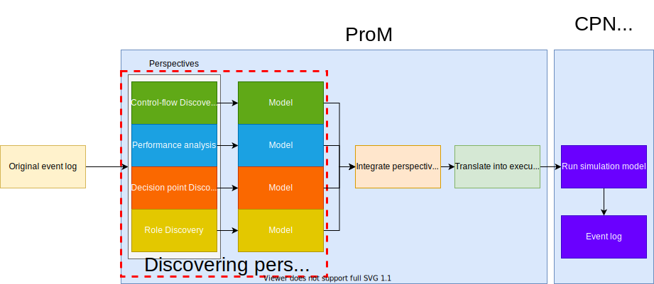
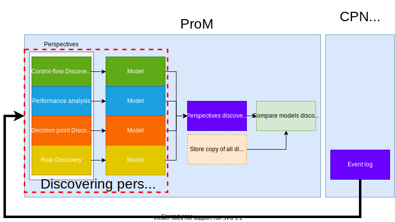
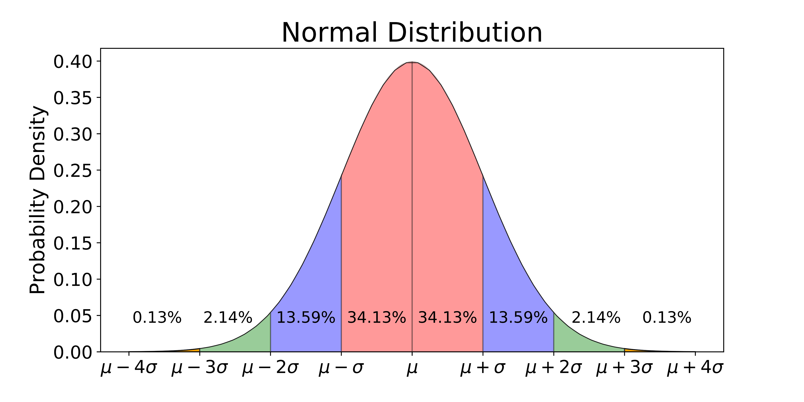

 
**Table of contents**
- [Process reengineering by use of model simulation](#process-reengineering-by-use-of-model-simulation)
  - [Contributions](#contributions)
  - [Paper structure](#paper-structure)
- [Background](#background)
  - [Process mining](#process-mining)
    - [Manifesto](#manifesto)
  - [Process mining fundamentals](#process-mining-fundamentals)
  - [Process mining and simulation](#process-mining-and-simulation)
  - [Analysis](#analysis)
  - [Simulation fundamentals](#simulation-fundamentals)
    - [Related works](#related-works)
      - [Creating simulation models](#creating-simulation-models)
      - [Process Mining and Simulation: A Match Made in Heaven!](#process-mining-and-simulation-a-match-made-in-heaven)
  - [Process design](#process-design)
  - [Tooling](#tooling)
    - [Simulation tools](#simulation-tools)
    - [Process mining tools](#process-mining-tools)
    - [Development tools](#development-tools)
- [Method](#method)
  - [Aim:](#aim)
  - [Approach](#approach)
  - [Research questions](#research-questions)
  - [Novelty](#novelty)
  - [Why (Project usefulness)](#why-project-usefulness)
  - [Deliverables](#deliverables)
    - [App](#app)
- [Concepts:](#concepts)
  - [Fundamental statistical concepts:](#fundamental-statistical-concepts)
    - [Measures of dispersion](#measures-of-dispersion)
  - [L* life-cycle](#l-life-cycle)
  - [Process log](#process-log)
  - [Process model](#process-model)
  - [Directly-follows graph (DFG)](#directly-follows-graph-dfg)
  - [Process reengineering](#process-reengineering)
  - [Process discovery](#process-discovery)
  - [Model validation](#model-validation)
  - [Process repair](#process-repair)
  - [Petri net](#petri-net)
  - [Colored petri net(CPN)](#colored-petri-netcpn)
  - [Bottleneck analysis](#bottleneck-analysis)
  - [Key performance indicators(KPI)](#key-performance-indicatorskpi)
  - [Statistical methods](#statistical-methods)
- [Definitions](#definitions)
- [Resources](#resources)

### Current progress and problems
Todos and otherwise are tracked [here](https://github.com/hpl002/Masters_Public/projects/1)

### Disclaimer
This document is simply a structured collection of notes and resources that is intended to be used as a reference when writing the more complete document. Please excuse any erorrs or inconsistencies. 
Due to copyright i have moved literature to a private repo, which is available at https://github.com/hpl002/Masters_Literature. Feel free to ask for read permissions if this is of interest.

 ----
## Process reengineering by use of model simulation
 
**Demonstrate how one can use process mining and model simulation to enhance process models by use of examples, while also proposing an alternative application architecture to the process mining framework ProM.** By running simulations of the generated process model we are able to generate new event logs which can then be analyzed for [key performance indicators](#key-performance-indicators-kpi). These KPI metrics are used to indicate if a process is in need of improvement. The tool serves two primary purposes:
1. used to conduct process enhancement
2. used to test the impact of some model alteration

The project builds on the method detailed in [Discovering simulation models](./resources/literature/discsim_is.pdf) where they employ a series of plugins available in the ProM framework and then export the simulation model to be used in the CPN Tools simulation application. While this is a fully functional approach i argue that it can be made easier and shorter by abstracting out the needed functionality from each of these applications and orchestrating them in separate docker containers. I present a simple application that is used to structure this workflow, pass arguments to each container, and pass data in-between containers.

While the ProM tool is undoubtedly the defacto process mining tool used in academia it is arguably difficult to use, difficult to expand on, and difficult to incorporate into other tooling and workflows. The scientific fundamentals, techniques, and methods that are made available by the tool are not disputed in this work and considered to be of high quality. I argue that process mining can benefit from inheriting the side effects or containerization, such as availability, scalability, and a clearly defined interface. 

While ProM is platform independent, it is not technology independent. Containers would allow for new plugins to be written in any language. The aim being that it should be easy to introduce and combine new techniques into the process mining ecosystem, no matter what language or technology it is built on.

### Contributions  
The project therefore has three contributions:
1. Demonstrate how process mining and simulation can be combined by exploring practical examples.
   - There exists works that explore these two topics, but few that detail the entire workflow. The aim is to provide a clear and accurate description of how one could conduct this and why the different workflow steps are important. 
   - Current literature often demands that the user is well versed in process mining and process engineering. This paper addresses these concepts from the outset that the reader has little to no prior knowledge.
2. Showcase an alternative method of structuring future process mining applications. While ProM is undoubtedly the de facto application for conducting process mining, it is not without faults. This project aims to address some of these critiques.
3. Provide a tool for conducting process mining and subsequent simulation in a single application. Current approaches demand that you jump between different applications and juggle files. This workflow can be improved.

**Tags**
Tags and keywords:  
1. Process mining
2. process simulation
3. process enhancement
4. process mining tooling

The project builds on the concept of [process reengineering](#process-reengineering) as put forth by Prof&#46;dr&#46;ir&#46; Wil van der Aalst, which uses the event log to enhance the process model. It has also taken strong influence from the method and techniques presented in several key papers that explore the intersection of process mining and simulation. 

Process mining and simulation is highly relevant for those who are conducting business process redesign.

"Through simulation experiments various “what if” questions can be answered and redesign alternatives can be compared with respect to key performance indicators." - [Process mining and simulation: A match made in heaven!](./resources/literature/p1002(1).pdf)

**The difficulty of process model fitness**  
TODO: find definition and reference of model fitness from conformance paper.  
Designing a process model without taking into account the dynamics of the environment in which it is deployed might lead to unforseen consequences. A process can be understood as a sequence of activities. An activity can be atomic or composed of multiple other activities. These activities often have strict depencencies on resources that are subject to change, such as human capital or machinery. Any change in the availability of one of these resources might lead to unwanted consequences such as delays and complete halts. Alternatively, having abundant resources will prevent the aforementioned, but lead to greater costs for the same throughput, i.e lower efficiencies. 

The ideal process lies within these two outer limits, ensuring the most amount of uptime and the least amount of wastage. This problem is addressed differently depending on how critial the throughput time is. 

By use of model simulation it is possible to finesse the model compositon until it meets the required performance metrics.

The fundamental problem being that we create process models with the expectation that we always have the required resources to execute the modeled activities. In the event where these are not available then there will be delays and halts, and in the event where these are always available then there will be wastage. When processes become large and complex it can become very expensive to keep throwing resources at them to ensure uptime. 

**Main artefact**   

The main artefact of this project will be a tool that is used to bridge this gap between process mining and simulation. By making it easy to simulate a given process model we can gather performance metrics and get insights into potential issues before the model is deployed. 

**Problemspace:**  
Rigid and dependale process models are unvaluable tools in critical environments. They allow for strict planning and act as a source of reference for stakeholders and give structure to complex activities. However, they can also lead to inefficiencies and lost profits due to this exact rigidness. 

Having a single process model designed to handle all scenarios is likely impossible. The undeniable trade-off of [granular processes](#granular-process) is that there might exist a scenario where the [process itself becomes counter-productive](#fallacy-of-granular-processes). This can be combated by desinging a process which allows for more flexibility and is more generic, otherwise known as a [coarse process](#coarse-process). However, these also have their [downsides](#fallacy-of-coarse-process)

>This project does not intend to solve the tremendous task of finding the perfect model, but rather provide a [tool](#app) that can be used to aid in the design or repair of process models. 

### Paper structure
Initially i will present a detailing of necessary background on the concepts of process mining, simulation, and tooling. Thereafter i will present the process mining method, my own method, research questions, and project novelty. The final section contains a list of concepts and resoruces that are referenced throughout the paper.

## Background
> A detailing of fundamental concepts and ideas.   
> Other areas and concepts that are more secondary are detailed in the [concepts section](#concepts).  

### Process mining
>The idea of process mining is to discover, monitor and improve real processes (i.e., not assumed processes) by extracting knowledge from event logs readily available in today’s (information) systems - [Manifesto](./resources/literature/2012_Book_.pdf)  

Process mining is a still a very new research field. Initially conceived by Prof&#46;dr&#46;ir&#46; Wil van der Aalst and with its earliest publications dating to the 1990s. The official date is perhaps 2009, as this was when the Task Force on Process Mining was originaly founded. The task force published a [process mining manifesto](./resources/literature/2012_Book_.pdf) in 2011 that detailed the state of the art at the time of publishing. Prof&#46;dr&#46;ir&#46; Wil van der Aalst has an extensive reputation and has either published, coauthored, or edited almost 900 works on the topics of process mining, petri nets, business process management, workflow managmeent, process modeling, and process analysis. He is with no exception considered the *godfater* of process mining. - [source](http://www.padsweb.rwth-aachen.de/wvdaalst/)

The published manifesto is therefore a good starting point for interested parties as it is published by and with the help of the most reputable sources in the field. It details its intentions, core concepts, the appointed task force, and core issues. 

#### Manifesto 
[Manifesto](./resources/literature/2012_Book_.pdf)  
*A manifesto is a public declaration of principles and intentions*  [Manifesto](./resources/literature/2012_Book_.pdf)
Process mining is a set of techniques used for extracting knowledge from event logs. Such logs are produced by modern infromation systems. Process mining technoques are intended to be used as a means to *discover, monitor, and improve processes in a variety of application domains*[Manifesto](./resources/literature/2012_Book_.pdf). The main forces behind the increased interest and relevance is data abundance and complexity. More and more data is being produced, and more complex systems are being developed. 

*Process mining is a relatively young research discipline that sits between computational intelligence and data mining on the one hand, and process modeling and analysis on the other hand. **The idea of process mining is to discover, monitor and improve real processes (i.e., not assumed processes) by extracting knowledge from event logs readily available in today’s (information) systems***

Process mining is composed of a series of smaller activities which all address different needs and purposes. Some activities are atomic, while others have strict dependencies on other activities. The main activities and their relevanve for this project are:
1. process discovery (Relevant)
2. conformance checking (Relevant)
3. simulation models (Relevant)
4. model extension (Relevant)
5. model repair (Relevant)
6. social network/organizational mining
7. case prediction
8. history-based recommendations

Process mining is perhaps best understood as an enabler of other well known business intelligence(BI) activities. Within BI we have for example:
1. Business Acivity Monitoring
2. Complex Event Processing
3. Corporate Performance Management
4. Continious Process Improvement
5. Business Process Improvement
6. Total Quality Management
7. Sig sigma 

##### Event logs <!-- omit in toc -->
For all intents and purposes, a process can be understood as a complex set of activities and relations. A case can be understood as a process instance that has traversed a particulat path of the desribed process. A process can have many paths, but a case can only traverse one. This traversal is recorded in event logs. An event log is a collection of occurances. These occurances or entries can be described using any number of fields, but process mining mandates that each entry has a trace identifier, activity identifier, and timestamp. A case can therefore be understood as a series of sequential occurances, and a process log most commonly contains multiples of these traces.

> Figure from [Manifesto](./resources/literature/2012_Book_.pdf) that show the three main activities of process mining.
Process discovery takes an event log as input and produces some process model. The model can be any number of formats, but most commonly as a petri net. Conformance checking takes an event log and process model as input and produces diagnostics. Most commonly used check if the event log aligns with some pre-existing process model. Can for example be used to locate traces that perform some actions that the underlying process does not support. Activitie that do not follow the proposed model can be an indicator of many things. The process model might be too generic and does not map reality, or be too strict and inaccurate and therfore forces alternate activities, and so forth. Lastly, process enhancement is about extending or improving some existing process model using information from the process event log and a process model. Enhancement through simulation falls within this last activity. The simulation approch is particularly interested in answering that which is coined "what if" question, such as: 
1. what happends if i restucture the process in *this* manner
2. what happends if a run a simulation that describes *this* scenario
3. what happend if i alter the resource capacity if *this* activity and run *this* simulation scenario
  
The relevance of simulation for process mining will be detailed in the following [simulation ](#simulation) section.  
 ##### Perspectives <!-- omit in toc -->
Literature often describes the mining of different *perspectives*. The notion of perspectives is intended to highlight a focus area. For example, the *control flow perspective* is interested in the ordering of activities and intends to find a good characterization of all possible paths. The *organizational perspective* focuses on information about resources hidden in the log, e.g what people, systems, roles, or departments are involved, to what extent, and how these relate each other. The *time perspective* focuses on the timing and frequency of events. It should also be noted that when an event has a timestamp, it is possible to discover bottlenecks, measure service levels, monitor the utilization or resources, and predict the remaining processing time of runnin cases.

##### Lifecycle of process mining project <!-- omit in toc -->

> Figure from [Manifesto](./resources/literature/2012_Book_.pdf) that show the traditional lifecycle of a process mining project.
*[The L* life-cycle](#l-life-cycle)* describes the core steps in a traditional process mining project. As seen in figure above, it consists of five steps, these are.
0. Step 0: Plan and justify
- here we might answer fundamental questions about the project aim, purpose, success criteria, etc.
1. Step 1: Extract
- At this stage we need to extract different types of data from the involved parties, such as the information system, stakeholders, domain experts, questions, models, and objectives. Requires an understanding of the available data and which parts are suitable for analysis. It required domain knowledge to have a understanding of fundamental and important questions. This step results in a different artefacts, such as handmand data, models, objectives or KPIs, and questions.
2. Step 2: Create control-flow model and connect event log  
- The control flow modle is constructed and linked to the event log. The control flow model can be generated via one of the available [process discovery methods](#process-discovery). 
3. Step 3: Create integrated process model
- Once the process is relatively structured, the control-flow model may be extended with other perspectives, such as data, time, adn resources.
- The relation between the event log and the model created in stag 2 is used to extend the model. 
4. Step 4: Operational support
- The models created in stage 3 may be used for operational support.
- Knowledge extracted from historical event data is combined with information about running cases. This again can be used to intervene, predict, and recommend. 
- > * Staged 3 and 4 can only be reacehd if the process is sufficiently stable and structured
  
More about the L* life-cycle can be found [here](#l-life-cycle). 

##### Guiding principles <!-- omit in toc -->
> Intended to combat common mistakes that one might encounter when emplring this new technology.
1. Event data should be treated as First Class citizens
  - The quality of a process mining result is heavily impacted by the input data. 
  - Event data should be viewed as a first class sitizen, as opposed to second tier. One should strive to create good high quality event logs, as opposed to this being some secondary activity. 
  - The quality of an event log can be gauged according to five levels of maturity. The quality metrics being:
  - 1. Trustworthyness
  - 2. Completeness
  - 3. Safeness
  - 4. Semantics
2. Log extraction should be driven by questions
   - Process mining activities need to be driven by questions.
   - Without concrete questions it is very difficult to extract meaningful event data.
   - Consider for example a ERP system with thousands of tables.
3. Concurrency, choice and other basic control-flow constructs should be supported
    - The control-flow description is the back-bone of any process model. 
    - *The control-flow description is the back- bone of any process model. Basic workflow constructs (also known as patterns) supported by all mainstream languages are sequence, parallel routing (AND- splits/joins), choice (XOR-splits/joins), and loops. [Manifesto](./resources/literature/2012_Book_.pdf)*
    - The aforementioned should be supported by process mining techniques. However, some technniques are not able to deal with concurrency and support only Markov chais/transition systems.
    - *It has been show that for real-life models having dozens of potentially concurrent activities the resulting models are severely underfitting (i.e., allow for too much behavior) and/or extremely complex if concurrency is not supported. [Manifesto](./resources/literature/2012_Book_.pdf)*
    - The effect of using some process mining technique that is unable to discover concurrency can lead to models that are severely underfitting, and/or extremely complex.
4. Events should be related to model elements
   - There needs to be a clear relation between the process model and the events in the event log. Several techniques *replay* the events from the log on top of the process model and therefore demand that there is no ambiguity. If there are any ambiguities then these need to be removed. The mapping problem is not just limited to events in the process log and modeled events, but also in relating events to process instances or cases. 
5. Model should be treated as a purposeful abstraction of reality
   - In reality we use different maps to orient ourselves in some environment. We have for example hiking maps, road maps, topological maps, etc. The importance here being that these reflect some abstraction of reality, and abstract away and ignore the information that is irrelevant. The same notion should be applied ot process mining models. There is no single model that fits all usecases. Some stakeholders might require some detailing that reflect a particular perspective, while others might want a high level overview. A single model cannot serve these two purposes successfully at the same time, they are contradictory. We therefore create multiple models that each serve a single purpose well, instead of creating a single model that serves multiple purposes poorly.
6. Process mining should be a continuous process
  - Given the dynamic nature of processes, it is not advisable to see process mining as a one-time activity.
  - The goal should not be to create a fixed model, but to breathe life into process models so that users and analysts are encouraged to look at them on a daily basis.
  - Millions of people use google maps on a daily basis and there exists thousands of tools that use their maps and project their own information on top of them. Their maps can be used for navigating to a destination, getting real time updated on traffic jams and delays, etc. What if we could apply the same analogy to process mining tools. We could use these tools to zoom in in a process activity to view its smaller sub activities. We could view delays and blockages. We could navigate through a process, and lastly provide predictions as to when the process would arrive at its end stop or "destination". 

##### Challenges <!-- omit in toc -->
> The manifesto lists a total of 11 challenges. Only those relevant will be presented in detail.
1. Finding, Merging, and Cleaning Event data
2. Dealing with Complex Event Logs Having Diverse Characteristics
3. Creating representative benchmarks
4. Dealing with concept drift
5. Improving the representational bias used for process discovery
6. Balancing between quality criteria such as fitness, simplicity, precision, and generalization
   - Events logs are seldom complete, only example behaviour is given. Process models allow for exponential or even infinite number of different races, and these traces can all have different probabilities of occuring. It is therefore unrealistic to assume that every possible trace is present in the event log. 
   - E.g: Given a process model with 10 activities that can be executed in paralell, the total number of possible interleavings is 10!=3628800. Given a process model with, say 100000 entries it would be impossible that all unique traces were present. Some traces are less frequent and may therefore be accounted as noise. It is impossible to build a model that also accounts for these infrequent traces, the discovered model needs to abstract these. Noise and incompleteness makes process discovery a challenging problem.
   - We have four competing quality metrics:
     - Fitness or Recall
       - The higher the fitness the more of the traces in the log the model can account for. Perfect fitness can account fro all traces in the event log.
     - Simplicity
       - With high fitness often comes high complexity, which is naturally unwanted. The simplest model that can explain the behaviour seen in the log is the best model, i.e Occams razor
     - Precision
       - a model is precise if it does not allow for too much behaviour. It would likely be possible to construct a simple petri net that had great fitness and is very simple, but this would have terrible precision as it would in essence allow for too much behaviour. A model that is not precise is underfitting, which is when the model over-generalizes the example behaviour in the log, i.e allows for behaviour that are very different from those present in the log. 
     - Generalization
       - A model should generalize and not just be limited to the behaviour seen in the log. A model that does not generalize is overfitting, which is the problem that occurs when the model is tailored to the behaviour seen in the log, when it is obvious that this is just example behaviour. 
      > Balancing fitness, simplicity, precision and generalization is challenging. This
is the reason that most of the more powerful process discovery techniques provide various parameters. Improved algorithms need to be developed to better balance the four competing quality dimensions. Moreover, any parameters used should be understandable by end-users.
7. Cross-organizational mining
8. Providing operational support
9.  Combining process mining with other types of analysis
    - There exists ample oportunities in the intersection of process mining and other research fields. For example, operational management and data mining provide valuable analysis techniques. The challenge being to combine the available techniques from these fields with those of process mining.
    - Process mining can be used in conjunction with simulation. It can be used to learn simulation models based on historical data. The simulation model can then be used to provide operational support, because of the close connection between the event log and the model, the model can be used to replay history and one can start simulations from teh current sate, thus providing a *fast forward button* into the future based on live data.
    - Process mining can be combined with visual analytics to further take advantage of humans visual analytics skills. VA exploits the amazing capabilities of humans to see patterns in unstructured data. 
10. Improving usability for non-experts
    - One of the great ProMises of process mining is the value it can add to workflows. Instead or process mining being a one stop activity or single occurance, it can be addd to existing workflows and produce results on a more frequent basis, often noted as a "living process model" because it changes more frequently. The current problem being that the available tooling is not intuitive for non-experts. The complexities of the different techniques and algorithms need to be abstracted out and hidden behind user friendly interfaces. 
    - > Creating more loosely coupled tooling with simple interfaces makes it easier to combine process mining into real life workflows.
11. Improving understandability for non-experts
    - Even if it is easy to generate process mining results, this does not mean that the results are actually useful. 
    - The user can have problems with understanding the output or is tempted to infer incorrect conclusions.
    - To avoid such probles the results should be presented using suitable representations (ref. guiding principle 5)
    - The trustworthyness should be clearly indicated
    - Existing process discovery techniques typically do not warn for a low fitness or for overfitting. They always show a model, even when it might be clear that there is too little data to justify any conclusions.

> Lastly, the manifesto also has a list of terminology which might be a useful reference for novices.

*Process mining is a growing and promising study area focused on understanding processes and to help capture the more significant findings during real execution rather than, those methods that, only observed idealized process model.* - [Process mining techniques and applications – A systematic mapping study](./resources/literature/1-s2.0-S0957417419303161-main.pdf)

 

> Figure that showcases the main areas areas of process mining, and subsequent sub-interests.   
> [Process mining techniques and applications – A systematic mapping study](./resources/literature/1-s2.0-S0957417419303161-main.pdf)

### Process mining fundamentals

*A **Petri net** is a dynamic structure that consists of a set of transitions, which are indicated by boxes and relate to some activity/task, or action that can be executed, a set of places, which are indicated by circles and may hold one or more tokens (indicated as black dots), and a set of directed arcs that connect these transitions and places with each other in a bipartite manner. Transitions are enabled as soon as all of their input places (places connected to this transition via an incoming arc) contain a token. If a transition is enabled, it may fire whereas it consumes a token from each of its input places and produces a token for each of its output places (places connected to this transition via an outgoing arc). In this way, the firing of a transition may change the marking of a net, and therefore the state of the process, which is defined by the distribution of tokens over the places.* - [Discovering simulation models](./resources/literature/discsim_is.pdf)

A decision point in a petri net is a place with multiple outgoing archs. A token can only be consumed by one of the transitions connected to these arcs. Each decision point is converted into a classification problem.

### Process mining and simulation
TODO: write about short-term simulation, transient and steady state analysis.
As stated in the previous section, proces mining can be used to *discover, monitor and improve real processes (i.e., not assumed processes) by extracting knowledge from event logs readily available in today’s (information) systems* - [Manifesto](./resources/literature/2012_Book_.pdf). The importance of process logs cannot be underestimated, and they are considered *first-class citizens.* However, event logs, as with all other logs, are recordings of events that have happened. They can tell us about the past, but nothing about the future. *
Simulation can be used to make process mining more forward-looking and explore different process changes. [Process mining and simulation: A match made in heaven!](./resources/literature/p1002(1).pdf)*

The promise of process mining and simulation is that it allows us to *explore different alternatives and to anticipate future performance problems.* Through simulation experiments various “what if” questions can be answered and redesign alternatives can be compared with respect to key performance indicators. - [Process mining and simulation: A match made in heaven!](./resources/literature/p1002(1).pdf). Existing event logs can be combined with simulation to produce accurate simulation models. Creating perfect simulations models is not possible as event logs are most often incomplete. Incomplete in the sense that they do not capture all possible traces and do not accurately represent how likely it is for a given trace to occur.

Discrete event simulation(DES) is a widely used approach to *play-out* process models. In process mining we have the *play-in, play-out, and replay* terminology that is used to describe the relationship between a process model and reality. As described in [Process Mining: Discovery, Conformance and Enhancement of Business Processes](./resources/literature/2011_Book_ProcessMining.pdf). *Play-out* refers to the traditional use of process models, where we generate behaviour given a petri-net. *Play-in* is the opposite of *play-out*, where example behaviour is taken as input and the goal is to construct a model, i.e inference. *Replay* uses both an event log and a process model as input. The log is then played on top of the model. *Whereas simulation focuses on play-out, process mining focuses on play-in and replay.* 

By use of DES we can generate new events via *play-out*. A singel simulation run produces a trace, and each trace has events that occur at a particular time. Paths and splits can be determined by assigning probabilities or via a random number generator. The waiting and service times for particular actions can be sampled from previous logs. All of this combined allows us to explore alternative model designs and compare them for key performance indicators. However, creating a accurate simulation model is difficult and time consuming. There are plugins for tools such as ProM and other existing techniques that can be used to swiftly create simulation models that can be run in CPN tools.  
 
 [Process mining and simulation: A match made in heaven!](./resources/literature/p1002(1).pdf) mentiones two major limitations of simulation approaches. Firstly, creating a good simulation model is very time consuming, and secondly, it is very difficult to create a model that accurately mimics reality. Simulation results are therefore often questiones as being unrealistic and simply a modeled reality. Simulation starts from a process model and produces behaviour and performance diagnostics. To create a simulation model we can invision the following workflow. Firstly, we generate a process model via a process discovery technique. We then replay the process log ontop of the generated model to analyze for bottlenecks and add temporal and stochastic behaviour to the model. This results in a process model that can be used to simualte a process. 

 Simulation models are usually exchanged via the extensible event stream(XES) standard, approved by IEEE and published as of November 11, 2016 [XES](https://xes-standard.org/). It defines a *tag-based language* that is based on XML. Specifically designed for describing event logs and event streams. 
 
 ##### Steady state and transient analysis <!-- omit in toc -->
Simulation and process mining can be combined to produce two analytical techniques. 
1. *Steady-state* analysis is perhaps the more common use of simulation in process mining, and follows the aforementioned workflow. That it, we have an event log that is used to produce a process model via discovery. We then replay the event log ontop of the discovered model to assign probability distributions and waiting times. We can run simulations of this resulting model and perform analysis on the resulting log. This allows us to capture traces that we would otherwise not have had, as well explore new model alterations.
2. Transient analysis or short-term simulation is often described as a *fast-forward button* into the future [Process mining and simulation: A match made in heaven!](./resources/literature/p1002(1).pdf),[Process mining: Data science in action](./resources/literature/Process_Mining_Wil_van_der_Aalst_Data_Sc.pdf). 
This technique concerns itself with performing simulations on the remainder of some ongoing trace. This is accomplished by creating new simulations models on the fly using real time and historical data. We can then load a ongoing trace into the simulation model and map its state. This then allows us to explore different futures for that ongoing case. Due to probability distributions this can result in accurate predictions. 

### Analysis
There are a wide assortment of analysis methods that can be employed in combination with process mining. Here we firstly separate them based on scope and subject of concern. We can outline three categories:
1. Model analysis. Concerned with discovering and quantifying the quality of some discovered process model. Here we are interested in the aforementioned quality measures, namely fitness, simplicity, precision, and generalization.
2. Performance analysis. Concerned with providing answers to performance oriented questions, such as the efficiency of a control flow, bottlenecks, and so forth.

When working with a process model it is always wise to ensure that the discovered model is of the necessary quality, as this model will serve as the foundation for the simulation model. Gathering and inspecting performance metrics is of upmost interest for this project as the questions of interest will be answered here. 

##### Model analysis  <!-- omit in toc -->

##### Performance analysis  <!-- omit in toc -->
The performance of a process can typically be defined by three dimension: time, cost, and quality. For every dimension there are different key performance indicators(KPIs) that can be defined [Process mining: Data science in action](./resources/literature/Process_Mining_Wil_van_der_Aalst_Data_Sc.pdf). 
[Process mining: Data science in action](./resources/literature/Process_Mining_Wil_van_der_Aalst_Data_Sc.pdf) describes performance indicators for the aforementioned dimensions. This being indicators for the time dimension:  

###### Time  <!-- omit in toc --> 
1. Lead time / flow time  
   Total time from the creation of a case until its termination. One might be interested in gathering the averages of all cases and then filtering out any cases that use more time then the average. Perhaps more importantly, is the lead time variance. Having some cases that finish in hours and others that take weeks can be indicative of odd behaviour.
2. Service level  
   The percentage of cases that have a lead time lower than a set threshold, e.g the percentage of cases that take longer than 2 weeks.
3. Service time  
   Time used on actual work. One can measure the service time on a case and activity basis. The service time often being jsut a fraction of the lead time.
4. Waiting time  
   The time a case is waiting for a resource to become available. Can be measured on a case or activity basis. E.g the time a customer has to wait before being served by a teller at the bank, or the time a patient has to wait before having needed surgery. 
5. Synchronization time  
   The time an activity is not yet fully enabled and waiting for an external trigger or another parallel branch. Unlike waiting time the activity is not fully enabled. 
   
###### Cost  <!-- omit in toc --> 
Here we might be interested in looking at what the actual cost of executing an activity or case is, what resources are being used, and to what capacity they are being used. Different costing models can be used, e.g: 
1. Activity Based Costing(ABC)
2. Time-driven ABC
3. Resource Consumption Accounting(RCA)

###### Quality  <!-- omit in toc --> 
Focuses on the product or service that is being delivered. Here we might look at customer satisfaction, reported complaints, reported defects, etc.

##### Performance analysis critiques  <!-- omit in toc -->

----

[A multi-dimensional quality assessment of state-of-the-art processdiscovery algorithms using real-life event logs](./resources/literature/1-s2.0-S0306437912000464-main.pdf)

Having poor process quality metrics is indicative of a process model that needs repair. There are two models in this setting. The "original" and governing model of the actual process. This model might not be available or exist at all. Then theres the process model which is generated through process discovery. 

Poor metrics can be indicative of multiple scenarios.
1. the generated process model is of poor quality
2. the generated process model is actually accurate, it is the underlying process which is poor

How can we determine where the project lies? With the underlying model or the generated model?

**process model quality metrics**:  
The metrics are tightly coupled.  
*Some metrics have been proposed to determine the quality
of a process model, such as fitness, simplicity, precision
and generalization*

Process Conformance is the type of process mining responsible
to measure the quality of a process model.

The quality of a process
model is usually described considering the four quality dimensions
( van der Aalst, 2016 ):
• Fitness: ability to observe the event log behavior in the discov-ered model;
• Precision: quality to avoid behavior unrelated to the used event
log in the discovery process, like avoiding underfitting concept;
• Generalization: capacity to accept new similar events related to
previous events used for discovering, like avoiding overfitting
concept; and
• Simplicity: quality to be as simple as possible.

Nominal work on process quality metrics:
[Process Mining: Discovery, Conformance and Enhancement of Business Processes](./resources/literature/2011_Book_ProcessMining.pdf)

1. model fitness 
   1. used to ensure the occurence of behaviors in event logs. Fitness is considered good if the process model supports the events in the process log. Poor if it does not support it. This can presumably be measured
2. model precision
   1. process model does not allows for unobserved activities. Does not allow for activities that are not observed in an event log. 
   2. Generalization claims that a process model is able to reproduce future activities.  
3. model simplicity
   1. requires that a process model with a simple structure can execute the behaviours in the event logs. 
   2. The simpler the model the better, i pressume..

### Simulation fundamentals 
Simulation as a technnique and simulation models are commonly used in most sciences, and have been a vital contributor to solving some of science's major problems. While these models come in all shapes and sizes we can characterize them by the fact that they highlight some specific traits of a subject matter and place this subject in a natural or artificial environment. Based on the registered behaviour we are able to deduce the relationships between cause and effect. 

Luckliy, the concept of processes and workflows are easy to comprehend and therefore make a excellent candidate for demonstrating how simulation might be used to solve a real world issue. [Creating simulation model](./resources/literature/discsim_is.pdf) details the nature of simlation models in the context or process mining and process design. They state that simulation models are an enabler of *what if* analysis and allows for a glimpse into the future under certain assumptions. The paper further details how simulation models are built and demonstrate their usefulnes by providing a running example. They look at the operational processes of two municipalities in the Netherlands and showcase how simulation can be used to estimate the benefit of some process redesign, and predict flow times for given states and other scenarios such as a reduced resource availability.

[A process-oriented methodology for evaluating the impact of IT: A proposal and an application in healthcare](./resources/literature/1-s2.0-S0306437913000951-main.pdf)

 
#### Types <!-- omit in toc -->
  - discrete event
  - continious 
  - parallel discrete event

#### Techniques <!-- omit in toc -->
 - Spin model checker 
 - Abstract Behavioural Specification Language
 - PM4PY
##### Available Algorithms <!-- omit in toc -->
  - Playout of a Petri Net
  - Monte Carlo Simulation
  - CTMC Simulation (DFG)
  - Extensive Playout of a Process Tree

TODO: 
- simulation algorithms
  - PM4PY

##### Discrete event simulation <!-- omit in toc -->
  "... models the operation of a system as a discrete sequence of events in time. Each event occurs at a particular instant in time and marks a change of state in the sytem. Between the consecustive events, no change in the system is assumed to occur; thus the simulation can directly jump tot teh " - [source](https://en.wikipedia.org/wiki/Discrete-event_simulation)

numerous studies can be found report-ing on the successful application of discrete-event simulation in order to improve efficiency and reduce costs.

Good overviews of literature have been provided by Jun et al. [17], England et al. [18], and Yang et al. [19].

With regard to healthcare clinics, Jun et al. [17] mention three different areas that impact patients in clinics. These are patient scheduling and admissions, patient routing and flow schemes, and scheduling and availability of resources.

17. [Application of Discrete-Event Simulation in Health Care Clinics: A Survey](./resources/literature/1999JoftheOperationalResearchSociety.pdf)

18. [TUTORIAL ON THE SIMULATION OF HEALTHCARE SYSTEMS](./resources/literature/2431518.2431686.pdf)

19. [Applications of Computer Simulation in Medical Scheduling](./resources/literature/Applications_of_Computer_Simulation_in_Medical_Sch.pdf)

 
However, despite the abundance of literature that exists on simulation and its application, there is hardly any literature on the intersection of process mining and discrete-event simulation.

[Discovering simulation models](./resources/literature/discsim_is.pdf)
#### Related works 
##### Creating simulation models 
The method and techniques demonstrated in the [Creating simulation models paper](./resources/literature/discsim_is.pdf) serve as the primary inspiration for this project. While simulation and process mining is a powerful combination, it is seemingly difficult to perform sucessfully. This is partly due to the inherent complexities of these techniques, but also due to a complex workflow that consists of a series of steps, plugins, and tools. This workflow can most definately be simplified and streamlined, and it is exactly this that i am trying to demonstrate by proposeing my alternative approach to orchestrating a process mining application. This is described in the [#approach](#approach) section.

By use of process mining tools we are able to extract different perspectives. These perspectives focus on specific aspects of the process log and extract information which is then used to create the executable simulation model. While there are likely many flavors of simulation models and accompanying tool suites, the most abundant model and tool used to conduct model simulation within the process mining space is Colored Petri nets(CPN) and CPN tools. This paper also used this combination.

Before we can start to explore different futures or model alternatives, we need to build a foundation. This foundation consists of a single simulaiton model which acts as the starting point for future alterations. The creation of this model and subsequent model changes can best be described as a series of three  or more "passes". The first two passes are to create the initial simulation model and then verify its accuracy. All subsequent passes focus on exploring some model alteration. 

To start, the first and second pass will be detailed by presenting an overview of each of theses passes. Then the third pass will be described by detailing the case studies from this paper. Lastly a detailing of the mentioned perspectives, and also a a technical presentation of the utilized plugins and algorithms is presented and connected to the described method.

##### First pass <!-- omit in toc -->
In the first pass we create and run the executable simulation model based on the original process log. Firstly we pass in the original event log and create a series of models where each model conforms to some specific perspective. Then these models are integrated into a single holistic model, which naturally now has information from all the perspectives. This model is then translated into a executable CPN model. The executable model is then run on the CPN Tools simulation engine while a separate mechanism logs all behaviours into a simulation log. This entire *first pass* is illustrated in the following figure. 

   
>Figure that showcases the "first pass" of the method described in [Creating simulation model](./resources/literature/discsim_is.pdf). 

Once the first pass has been completed we are left with a log of all executions performed in the simulation model, otherwise referred to as a simulation log. This initial execution of the discovered simulation mode is performed to first ensure that the model is correct and indeed executable. Secondly, we perform it so that we have new datapoints which can then be used to measure the accuracy of this discovered simulation model. 

##### Second pass <!-- omit in toc -->
Given that the simulation model is intended to represent the reality that has been recorded in the event logs, it is important that it is accurate. We can therefore run this simulation log through the same exact process mining algoritms used to discover the perspectives  

During model execution in CPN Tools we are able to create a execution log, which is similar to the original event log. This execution log is then fed back into prom and through all the process mining algorithms used to discover the different model perspectices. By comparing information from the first and second pass we are able to measure the fitness of our simulation model.  
   

##### Third pass <!-- omit in toc -->

##### Process mining from different perspectives <!-- omit in toc -->
By applying different process mining algorithms we are able to extract key characteristics from the different perspectives, which are then combined to create the simulation model. The perspectives being:
1. **Control flow**  
   Discover process model by use of one of the many available process discovery algorithms. This perspective captures the causal relations between the log activities. *Aims at the automatic extraction of a process model from an event log, i.e inference of a structureal representation of the underlying process based on historic data.* The authors decided to use the a-algorithm, but there are of course other options. The algorithm outputs the underlying business process in the form of a petri net. 
2. **Role discovery**
   Focuses on the organizational perspective of the process. Aims at discovering the organizational model and assignment rules. The **organizational model** contains a representation of the relationships between resources and their roles, or functional units. The **assignment rules** are the relatonships between the roles and and activities.
3. **Decision point analysis**
   The aim of this multipart analysis it to discover what data dependencies influence the routing of a case, i.e discover rules. In other words, what characteristics of a case determine its routing. Based on these characteristics we can turn every decision point into a classification problem and use the available process log as the training set since we allready know what paths these traces have traversed. 
   
   From this we learn a series of rules which are then used to classify future cases. Example characteristics can be age, diagnosis, condition, and more. These characteristics determine what path the trace will traverse once it arrives at a choice point. A choice point is considered synonymous with decision points in petri nets, which is a point with multiple outgoing arcs. 

   Firstly we need to identify all choice points in the business process. Then we need to build our training set. The training set is built by classifying all log entries according to what branch they have traversed. This can be inferred by looking at the first event of in the case after the decision point.

   We can imagine a scenario where we have two patients that have been submitted to the hospital, as depicted in the figure below.  
   
   > Simple figure displaying how classification rules that are used at decision points can be inferred from patient attributes.

   The simple process contains a sigle decision step where it is determined wether the patient is in need of a MRI or not. The decision point is easy to discover because it has multiple outgoing archs. We can create two classes (A,B) that represent the two arcs. In the event log we have two cases, with each case having two log entries. These entries log that the patient has been submitted and the preceding event after the discovered decision point. Based on this last log event we can classify the case as either A or B, depending on what arc it traversed. Now that we have groups of cases we can attempt to determine whether the decision might be influenced by case data, i.e whether cases with certain attriutes follow certain routes. From this simple example and limited samlpe size we can infer a binary classification, which is that if the subject is 60 years old or younger then they do not need an MRI and vice versa.

 Real world process models and logs are of course far more complex than the given example. There exists a number of algorithms that can help with solving these classification problems. The algorithms used in this paper was based on decision trees, more specifically the *C4.5 algorithm.*
   
4. **Performance analysis**
   Gather information about the performance perspective, i.e the execution times, waiting times, probability distribution, and case generation schemes. The execution time is the timespan from activity start to end. Waiting time it the timespan from the end of some activity A1 that preceeds the start of A2. In effect the timespan between the end and start of two activities in a queue. The probability distribution indicates how likely it is that an arch or path is traversed. This is not to be confused with the classification rules discussed in the previous section. While both focus on decision points and their preceding activities, they differ in that the classification rule is what determines what path the case will traverse, while the probability is simply a handy statistic showing how likely it is that the path is traversed given all traversals in the log going through that decision point. The case generation scheme determines the process arrival interval, so how many cases arrive at the process every time unit. Gathering these statistics is pretty trivial. Some information can be gathered by simply looking at the process log, while other information such as execution time, waiting time, and probabilities can be gathered by replaying the process log on the discovered process model. The gathered data is then used to enhance the process model. 

   During replay we can also gather statistical values such as minimum, maximum, mean, variance, etc, for each of the aforementoned metrics. *While we do not know the underlying distribution for the obtained execution and waiting times, we assume that these follow a normal distribution.* Likewise, we do not know the distribution of the case generation scheme and assume a negative exponential distribution for the interarrival process or *Poisson arrival process.* To specify the execution and waiting times in terms of a normal distribution, we need to calculate their mean and variance values for each activity.

   *A organizational model usually contains organizational units, roles. resources, and their relationships.* Within such a model there can be hierarchies and complex mapping. Deducing these relationships from a event log can be difficult. However, it is possible to deduce **resource groups** in which the people execute similar activities. These groups often correspond to a organizaional unit, which can be a specific role or a set of roles that perfrom similar activities. 

##### Merging perspectives <!-- omit in toc -->
The aforementioned perspectives are merged into one single model to help get a better and more holistic view of the detailing process. The merging is easy as long as the discovered perspectives have no conflicting information. We can imagine a layering of perspectives which then ultimately result in a single model. While this model has detail, it is not executable. The holisitc model is transformed into a executable Coloured petri net via the method described in [Discovering colored Petri nets from event logs](./resources/literature/Rozinat2008_Article_DiscoveringColoredPetriNetsFro.pdf).
 
##### Process Mining and Simulation: A Match Made in Heaven!
> [Process Mining and Simulation: A Match Made in Heaven!](./resources/literature/p1002(1).pdf)
Paper written by Wil Van der Aalst and published in 2018. 
###### Abstract(Shortened) <!-- omit in toc -->
Process mining provides the means to discover the real processes, to detect deviations from normative processes, and to analyze bottlenecks and waste from such events. However, process mining tends to be backward-looking. Fortunately, simulation can be used to explore different design alternatives and to anticipate future performance problems. This keynote paper discusses the link between both types of analysis and elaborates on the challenges process discovery techniques are facing. Quality notions such as recall, precision, and generalization are discussed. Rather than introducing a specific process discovery or conformance checking algorithm, the paper provides a comprehensive set of conformance propositions. These conformance propositions serve two purposes: (1) introducing the essence of process mining by discussing the relation between event logs and process models, and (2) discussing possible requirements for the quantification of quality notions related to recall, precision, and generalization.

##### Technical model <!-- omit in toc -->
> Give an initial overview of what plugins and techniques were used. Connect these to the aforementioned perspectives.
> Then give technical details of each plugin that was used. Inputs and outputs. Link any papers

### Process design

Process design and modeling is widespread and used in both business and academia. We therefore have techniques and specifications that are unique to their respective domain. In this project i do not focus on a specific notation, but rather [petri nets](#petri-net).  

#### Granular process <!-- omit in toc -->
*Also known as a narrow process.*  
Process with smaller pieces. Not flexible, but detailed.

#### Coarse process <!-- omit in toc -->
*Also known as a wide process.*  
Process with many large chunks. Not detailed, but flexible.

#### Fallacy of granular process <!-- omit in toc -->
*Narrow, detailed, rigid, strict.*  
Process is so granular (detailed) that it allows for no flexibility. This hampers all efficiency the second some unaccounted event occurs. If one single activity stops then this can causes delays in all dependent activities.

#### Fallacy of coarse process <!-- omit in toc -->
*Wide, flexible.*  
Process is so coarse (generic) that it allows for too much flexibility. This leads to unceirtanty and can make the process difficult to follow. Also leads to many altering process flows which then results in poor event logs. Having a ill defined process can have the same results as having no process definition at all.
 
#### The "sweetspot" <!-- omit in toc -->
A perfect combination of granularity and coarseness is perhaps unobtainable, but the sweetspot is having granularity and flexibility where they are needed. Some activities need to be very detailed, while others rely on there being some flexibility. This knowledge is obtained through domain experience,trial, and error.

### Tooling

In the last decade, many tools have emerged to support process
mining. However, the majority of publications use the ProM frame- work, 6 a very powerful and open source framework ( van Don- gen, de Medeiros, Verbeek, Weijters, & van der Aalst, 2005 ). ProM offers a pluggable architecture and is one reason why research communities embrace this framework. ProM allows flexibility in developing new algorithm (plug-ins), extending and combining them with standardized input and output formats. However, there are other options, such as Aris Process Performance Manager from Software AG, 7 BAB Framework 8 (Best Analytics of Big Data), Celo- nis Discovery, 9 Disco from Fluxicon, 10 Myivenio from Cognitive Technology, 11 Perceptive Process Mining from Lexmark (acquired by Hyland Software 12 and previously started by Pallas Athena as FLOWer)), Process Gold, 13 QPR ProcessAnalyzer, RapidProM, 14 SNP Business Process Analysis, 15 Signavio Process Intelligence, 16 Up- Flux, 17 and others.

6 http://www.ProMtools.org . 7 https://www.softwareag.com/ . 8 https://www.babcloud.org . 9 https://www.celonis.com/ .
10 http://www.fluxicon.com/disco . 11 https://www.my-invenio.com/ . 12 https://www.hyland.com/ . 13 http://processgold.com . 14 http://www.rapidProM.org/ . 15 https://www.snp-ag.com/ . 16 https://processmining.signavio.com/ . 17

 - from [Process mining techniques and applications – A systematic mapping study](./resources/literature/1-s2.0-S0957417419303161-main.pdf)

An approach to acquire, exchange, and analyze event logs was proposed, and this standard is called Extensible Event Stream (XES)
( Xes, 2016 ).

#### Simulation tools
This section will detail some popular tool choices and their underlying techniques.

##### Process Mining 4 Python(PM4PY) <!-- omit in toc -->
Python library composes of a series of methods relevant to process mining. The library has 9 main categories: 
1. Handling event data
2. Filtering event data
3. Process discovery
4. Petri net management
5. Conformance checking
6. Statistics
7. Evaluation
8. Simulation
9. Social network analysis

This will utilize this tooling for different purposes, such as process discover, conformance checking, process analysis, and possibly simulation.
The library offers three simulation algorithms:
1. Playout of a Petri Net
   "Takes as input a Petri net with initial markings, and returns a list of process executions that are allowed from the process model"  
   We can get back a specified number of process executions, up to a number.  
   Returns all the executions that are possible according to the model, up to a provided length of trace (may be computationally expensive)  
   **This method might be useful if the aim is to collect a set of all unique process executions.**
2. Monte carlo simulation
   "A time-related simulation permits to know how probable is that a process execution is terminated after a given amount of time."  
   Leads to better identification of the process instances that are most likely to have high throughput time.
   Requires a DFG model, and knowledge of the case arrival ratio.
   **This method might be useful if the aim is to determine how probable it is that a process will finish within X days**
3. Continuous Time Markov Chain(CTMC) Simulation(DFG)
   "A time-related simulation permits to know how probable is that a process execution is terminated after a given amount of time."
   Requires a DFG model.
   **This method might be useful if the aim is to determine how probable it is that a process will finish within X days**
4. Extentive playout of a process tree
   "An extensive playout operation permits to obtain (up to the provided limits) the entire language of the process model."

##### Colored Petri-nets(CPN) & CPN Tools <!-- omit in toc -->
The most cited and used simulation technique in combination with ProM. Given that ProM is the de facto standard for process mining, it comes as no surprise that CPN tools follows suit, as ProM has plugings for exporting to CPN.

##### ABS <!-- omit in toc -->

#### Process mining tools
##### ProM <!-- omit in toc -->
Fundamental criticism.  
There are likely opinionated works that comment on this.  

What is the basic workflow in ProM  
How are methods and techniques combined?  
ProM does not have a public facing library or package manager. Why are they hoarding?  

**conducting simulation in ProM:**  
Discovering simulation model: 
  
source: http://www.processmining.org/ProM/miningcpntutorial

Workflow Simulation Models:
    
source: http://www.processmining.org/yawltutorial

##### PM4PY <!-- omit in toc -->

##### docker <!-- omit in toc -->
tiny images: https://github.com/iron-io/dockers  

#### Development tools
##### Tool for drawing and editing directed graphs <!-- omit in toc -->
**required features:**  
1. delete nodes
2. add nodes
3. delete paths 
4. add paths
5. add label (weight)
6. replay?  

Options:
   - Graphviz - Graph Visualization Software (as used in "Automated simulation and verification of process models discovered by process mining")
     - !!dont think this has the ability to edit the graph
     - 
 
## Method

### Aim:
The project has two aims, these are:
#### Primary Aim <!-- omit in toc -->
Create a web based tool that allows for quick and easy simulation of process models in a interative manner.

#### Secondary Aim <!-- omit in toc -->
Demonstrate how existing process models can be improved by use of the tool.  

Verify or dismiss the effect of the implemented model changes by running accurate simulations on the enhanced models.  

> ...the “Achilles heel of process mining” is the fact that it is backward-looking. Process mining can be used to diagnose problems (e.g., bottlenecks or non-compliance) and predict the paths taken by running process instances (i.e., cases), but it cannot be used to answer “what if” questions and explore radical redesigns. Given the above, it is very natural to combine process mining and simulation.   
> 
> Source: [Process mining and simulation: A match made in heaven!](./resources/literature/p1002(1).pdf)

> A high level overview.   
> The resulting application will be a detailed instance of this exact model.

**Steps:**
1. The event log will have to be prepared by the user. This includes filtering, grouping, and cleaning.
2. The event log is then uploaded.
3. Envent log is transformed to a process model by use of on of the [process discovery algorithms](#process-discovery).
4. The model will then have to be checked for [validity](#model-validation). 
   1. Process discovery will often not yield a perfect model. There might be need to intercept and edit.
   2. There are techniques for both manual and automatic model checking.
6. The resulting model is then simulated by use of one of the [simulation techniques](#simulation).
7. The simulation will yield a new event log. This is then analysed by of appropriate [techniques](#process-analysis).
8. Lastly, the user has to reason over the resulting metrics. If the metrics are not are not as expected then this issue needs to be resolved by altering the model composition. The user jumpts back to step 4.

### Approach
As described, the fundamental method employed in this paper builds on the method used to build executable simulation models in [Discovering simulaton models](/resources/literature/discsim_is.pdf). This paper explores how one can build a detailed simulation model by creating individual models that focus on some perspective of the event log, and then combine these into a single holistic model. This model is then translated into a executable simulation model that can run in CPN Tools. The described method is executed by a series of plugins in ProM, as well as the completely separate CPN Tool application. While ProM can run on any system that has Java, CPN Tools it not as flexible and has much more restrictive system requirements, e.g its gui application cannot run on any unix based system. However, the simulator on which CPN Tools is built on can be compiled to run on unix. Prom plugins are used for translating model formats, creating a model that focuses on a specific perspective, and lastly to combine and translate the holistic model into an executable model. The CPN Tool is used to execute the simulatio model and generate new event logs.

Some plugins are fully automatic and require no arguments other than the process log, while others require several parameters and generally more finesse. Given that one has to go through a series of steps, plugins, and tools in order to end up with the resulting process log, i think that this could be made easier by stripping away some of the inherent complexitites of these plugins, but also the complexities of using ProM. While ProM is the defacto tooling and has a track record spanning over a decade, it is not very intuitive and is bound to the local Java Runtime. Other tooling such as fluxicon's Disco have managed to create a tool that is easy and intuitive to use, but lack the same featureset that is available in ProM. ProM's plugin system is a clever way of allowing new methods and techniques created by the community to be introduced to the process mining space, but these plugins are naturally bound to the same requirements as ProM. While this approach is fully functional, it is arguably far from ideal as it forces researchers and developers to write new plugins in java. Reusing these plugins elsewhere would then require that they are reimpemented or ported to a more flexible format.

There exists other projects that have addressed this interoperability concern, such as the process mining library for python - PM4PY. However, this does not offer the same "no-code" approach as Prom plugins, but it is more flexible.

I argue that using docker containers might be a more feasible approach to orchestrating a ecosystem that is fundamentally built on plugins. These containers do not share resources with the underlying host and communicate over networking protocols. This creates a much clearer separation of concerns and comes with other benefits:
1. Plugins can have separate front and backends. This is possible by creating two completely separate applications within the same container.
2. Flexibility: Plugins can be written in any language and use any runtime. Given the abstraction layer that comes with containers the developer is no longer bound by creating a plugin that integrates with the existing plugin system i ProM.
3. Flexibility. Given that containers are completely independent, this would allow for them to be incorporated other systems. 

    
### Research questions
   > Current RQs are subject to change..  
Current draft:  
1. How can simulatons be used to verify the outcome of a process model?  
2. How can simulatons be used to improve a real life process model?  
3. What simulation algorithms exist, and what scenarios are they fit for?    
4. How can one use existing tools to conduct process mining and simulation, what workflows exist and what tools are popular?
   1. How well does this work?
   2. How can it be improved?

### Novelty 
> Overlaps with [#yet-another-tool](#yet-another-tool)   

1. issues with current tooling and perhaps academic tooling in general
   1. describe current trends and existent tooling
   2. by creating a web based tool that uses async http requests in the process we are also making it easier for new developers and researchers to introduce their techniques into this process flow
      1. say you have a new model checking technique then you can simply craete a dockerized application of it and substitute your method instead of using the default
2. transition from research to production is difficult?
   1. use ProM for research and then use what for production?
3. process mining and modularization of software is non-existent
   1. there are some ad-hoc docker images of commonly used applications
4. Does curretly not exist a tool with the described [feature set](#app).  

The general technique describes is not unique. Process mining and simulation is not unique. Creating an app that allows for different methods to be combined is unique.

Automation possibilities? 

### Why (Project usefulness)

**Extract from initial proposal:**

> We can mention one example from treatment of age-related macular degeneration in the eye clinic at Haukeland University Hospital. By analyzing patient data, it was found that in some cases it takes less than 15 minutes to provide the necessary injection, and in other cases it takes as much as 45 minutes. **Based on the data, nurses were trained to handle the easy cases, while specialists handled the more complex cases. It reduced the workload for the specialists, and it was possible to provide services to more patients without comProMising the quality.** With this arrangement of training nurses with responsibilities that requires relatively lower competence, it was possible to provide better services at reduced cost, as specialists could do more complex tasks. However, **there is a lack of tool support for this kind of careflow analysis in the hospital, even though it is very important for the management and planning of resources, and to improve the service quality.**

We can simplify this process into the following basic [petri net](#petri-net):

This process could be resolved by adding a two new actions. A classification action where it is determined if the patient is a demanding or a easy case. And secondly a treatment step where the easy cases can be handled. 

 

> Provided that the process has been given a new a path we can expect improvements in the time spent in place P3 and P4. However, we now have to also consider the time spent to diagnose the patient in P2.

TODO: reference process mining and simulation paper, a match made in heaven for the usefullness and ProMise of combining these two techniques.

#### Yet another tool? <!-- omit in toc -->
1. Why do we need another tool?
2. find work that details existing tooling
3. what is the problem with the tools that exist
4. what is it that this tool is trying to solve that other tools do not have

 
 

### Deliverables  
#### App
**Feature set:**  
- Upload event log and translate this into a process model.
    - Allows for the user to select the process discovery algorithm to be used
  - Upload process model directly
- View the resulting petri net
- Edit the resulting petri net by adding or removing places or transitions
- Run simulation by selecting one of the available simulation methods
- Run process analysis that fetches key performance indicators (KPI)

> The web application is packaged in a easy to use interface that is designed for quick iteration. This again allows us to explore model alternatives with quick succession. While the app does return some performance indicators, it does not try to make intelligent observations about its results. It is the responsibility of the process mining expert and domain experts to reason over the results. 

## Concepts:
### Fundamental statistical concepts:
#### Minimum <!-- omit in toc -->
The smallest value of some set.
#### Maximum <!-- omit in toc -->
The largest value of some set.
#### Mean or average -  &mu;<!-- omit in toc -->
The average value of some set, also called the expected value.
Given set S = {3,4,5,6}  
The sum of all entries = 18  
Number of entries or |S| = 4  
Mean = sum / |S| == 4.5
#### Measures of dispersion
##### Range <!-- omit in toc -->
Indicator of spread in the set.   
Maximum subtracted by Minimum
##### Variance - &sigma;2 <!-- omit in toc -->
It measures how far a set of numbers is spread out from their average value.  
Get the difference of every entry in your set and the mean value and square this.
Then get the mean of this new set of values.

##### Standard deviation - &sigma; <!-- omit in toc -->
A single measure of the amount of **variation or dispersion of a set of values.** A low SD signifies that all values lie close to the mean, while a high SD indicate that the values are spread out wider. Represented as the greek letter &sigma; and calculated as the square root of its variance or &radic;&sigma;2.
##### Normal distribution <!-- omit in toc -->
Probability function that describes how the values of a variable are distributed.   
The normal distribution is the pattern of data, whenever you measure a population or a set of scores with some randomness. Also known as Gaussian distribuiton or the "bell" shaped curve. Used to show the mean value and standard deviation. 

To draw a normal distribution we need:
1. **mean**  
   Defienes the location of the peak
2. **Standard deviation**  
   Measure of variability and determines the width of the normal distribution. Represents the typical distance between the observations and the mean. Chancing the SD either tightens or spread out the width. Larger SDs create a graph with more spread. When we have narrow distributions, the probabilities of values falling closer to the man are higher. When we have wider distributions then the probabilities of values falling further from the mean are greater. 

All normal distributions have the following properties:
1. Symmetric
2. Mean, mode, and median are the same
3. Half of the populaton is greater than the mean and half is less.
 
### L* life-cycle
A well know paper published by van der Aalst (2011) proposed the L ∗ life-cycle model consisting of five phases for conducting a process mining application.

- Plan and justify phase-focus is data-driven to explore and answer curiosities and gain insights; or, question-driven focused on explaining a specific situation e.g., why determined issues occur; or, goal-driven focused on improving the KPI, response time performance, explain deviations, reduce costs.
- Extract-explore the knowledge system data domain for recover- ing relevant events. Sometimes it can be very time-consuming owing to system complexity, e.g., with thousands of repositories spread among many tables.
- Discover a process model based on event logs-process miner algorithms are used to obtain a process model. When an un- derstandable model is acquired, it is possible to start confor- mance checks, analyzing activities and deviations to the discov- ered process model.
- Create integrated process model-enhancements and added in- formation are integrated in the model, ProMoting new perspec- tives related to time replayed, organization, resource utilization, case comparisons, and simulation, among other possibilities.
- Operational support-involves detecting, predicting, and recom- mending. This is the most advanced level of computational sup- port, for example, the process mining tool should be capable to alert (email) on deviation cases, provide advice about bottle- necks, recommend resource setup or reallocation, etc

### Process log
Zakarija I, Škopljanac-Macina F, Blaškovic B. Discov- ering process model from incomplete log using pro- cess mining. In: 2015 57th International Symposium ELMAR (ELMAR); ÍEEE; 2015. p. 117–120.

### Process model

Process model is a formal or semi-formal representation of underlying processes behaviour, performance and conformance - [source](van der Aalst WMP. Data science in action. New York, NY: Springer; 2016).

### Directly-follows graph (DFG)
[A practitioner's guide to process mining: Limitations of the directly-follows graph](./resources/literature/dfg.pdf)

### Process reengineering
*Process Reengineering (PR): improving or extending the model based on event data. Like for conformance checking, both an event log and a process model are used as input. However, now the goal is not to diagnose differences. **The goal is to change the process model.** For example, it is possible to “repair” the model to better reflect reality. **It is also possible to enrich an existing process model with additional perspectives.** For example, replay techniques can be used to show bottlenecks or resource usage. **Process reengineering yields updated models.** These models can be used to improve the actual processes.* - Wil Van der Aalst
[Source](https://www.researchgate.net/project/Responsible-Event-Driven-Process-Improvement-REDPI)

  ### Process discovery
  The process discovery algorithm is responsible to generate a process model based on any a-priori information, such as an event log ( van der Aalst, 2016 ).

  write about the different process discovery algos:  
  alpha algorithm, heuristic mining, multiphase mining, fuzzy mining, genetic mining, region miner, integer linear programming (ILP) miner, declarative miner, etc.

  This discovery process should deliver a model with quality, where it is expected to be comprehensible by avoiding unnecessary complexity, and deliver acceptable accuracy, balancing recall, precision, and generalization ( Weerdt et al., 2012 ).

The result of a process discovery algorithm can be evaluated considering four quality dimensions can be characterized: fitness, simplicity, precision, and generalization ( van der Aalst, 2016 );

  

inductive machine learning
 - k-tail algo / Biermanns algo  

  Zakarija I, Škopljanac-Macina F, Blaškovic B. Discov- ering process model from incomplete log using pro- cess mining. In: 2015 57th International Symposium ELMAR (ELMAR); ÍEEE; 2015. p. 117–120.

  ### Model validation
  SPIN model checker  
  "Spin model checker is primarily used for formal verifica- tion of distributed systems, such as communication protocols. Spin can run random simulations of the process model or perform a verification of the pro- cess model by exploring all the possible execution paths. To formally describe process models, we use Spin’s ProMela language (Process meta language)."

[Spin Model Checker, The: Primer and Reference Manual](./resources/literature/spinPrimer.pdf)

 
"Model checking is a formal method for software and hardware system verification.Its goal is to check whether a model of a system satisfies given specifi-cation."
  
[Workflow mining: Discovering process models from event logs](./resources/literature/01316839.pdf)

[Process Mining and Verification of Properties: An Approach Based on Temporal Logic](./resources/literature/2005_Book_OnTheMoveToMeaningfulInternetS.pdf)

> figure taken from [here](#process-mining-techniques-and-applications--a-systematic-mapping-study)

  ### Process repair
  Process repair is primarily conserned with the repairing of the model that is generated through model discovery.  
  [An Approach for Repairing Process Models Based on Logic Petri Nets](.resources/literature/08370624.pdf)  
  [A Profile Clustering Based Event Logs Repairing Approach for Process Mining](./resources/literature/08625568(2).pdf)

### Petri net
A petri net is one of several mathematical modelling languages used for describing distributed systems. Contraty to its more advanced descendants, petri nets are very basic and only model places and transitions.

### Colored petri net(CPN)
Source: [A brief introduction to Coloured Petri Nets](./resources/literature/Jensen1997_Chapter_ABriefIntroductionToColouredPe.pdf)
CPN is a graphical oriented language for design, specification, simulation and verification of systems. Typical examples of application areas are communication protocols, distributed systems, imbedded systems, autoamted production systems, **workflow analysis** and VLSI chips. Combined the power of petri nets with the strength of programming languages. Petri nets provide the primitieves for the description of the synchronisation of concurrent processes, while programming languages provide the primitieved for the definition of data types and the manipulation of data values.

Petri nets have three basic components: places, transitions, and arcs. Places describe the states of the system. Transitions describe actions, and arcs describe how the state of the CP-net changes when a transition occurs. 

Each place contains a set of tokens. Each of these tokens carry a data value of a given type. 
**Coloured Petri Nets have got their name because they allow the use of tokens that carry data values and can hence be distinguished from each other -- in contrast to the tokens of low-level Petri nets, which by convention are drawn as black, "uncoloured" dots.**

The syntax and semantics of CP-nets have a formal definition,
which is the basis for syntax check, simulation and verification of CPN models.

The relationship between CP-nets and ordinary Petri Nets is analogous to
the relationship between high-level programming languages and assembly code.
In theory, the two levels have exactly the same computational power. However,
in practice the high-level languages offer much more modelling power, because
they have better structuring facilities, e.g., types and modules.

**What exactly is the relation between process mining, CPN, and simulation?**
From a process log we can generate a process model via process discovery algos. This model can be enhanced with perspectives and then exported to a CPN simulation tool.

How exactly is simulation conducted in CPN?  
What algo is working in the background?  
What does the input file look like?  

[Colored Petri Nets: A Graphical Language for FormalModeling and Validation of Concurrent Systems](./resources/literature/cpn-acm-2015.pdf)  
   
### Bottleneck analysis
### Key performance indicators(KPI)
### Statistical methods

 
## Definitions  
**Bottom-up process redesign**
Redesigning some process by looking at process data 

**Top-down process redesign**
Redesigning some process by looking at process documentation            

## Resources
#### Background and current trends in process mining <!-- omit in toc -->
1. [Process mining techniques and applications – A systematic mapping study](./resources/literature/1-s2.0-S0957417419303161-main.pdf)
2. [A Brief Introduction to Coloured Petri Nets](./resources/literature/Jensen1997_Chapter_ABriefIntroductionToColouredPe.pdf)
3. [Model-Driven Software Engineering in Practice](./resources/literature/Model-Driven%20Software%20Engineering%20in%20Practice.pdf)
4. [Redesigning business processes: A methodology based on simulation and process mining techniques](./resources/literature/Măruşter-Beest2009_Article_RedesigningBusinessProcessesAM.pdf)
5. [An introduction to systems modeling and simulation with colored petri nets](./resources/literature/012.pdf)
6. [Process Mining: Discovery, Conformance and Enhancement of Business Processes](./resources/literature/2011_Book_ProcessMining.pdf)
7. [Process mining: Data science in action](./resources/literature/Process_Mining_Wil_van_der_Aalst_Data_Sc.pdf)

#### Process mining and simulation <!-- omit in toc -->
1. [Discovering simulation models](./resources/literature/discsim_is.pdf)
2. [Business Process Simulation: How to get it right?](./resources/literature/BPM-08-07.pdf)
3. [Combination of Process Mining and Simulation Techniques for Business Process Redesign: A Methodological Approach](./resources/literature/2013_Book_Data-DrivenProcessDiscoveryAnd.pdf)
4. [A process-oriented methodology for evaluating the impact of IT: A proposal and an application in healthcare](./resources/literature/1-s2.0-S0306437913000951-main.pdf)
5. [Process mining and simulation: A match made in heaven!](./resources/literature/p1002(1).pdf)
6. [Automated simulation and verification of process models discovered by process mining](./resources/literature/Automated%20simulation%20and%20verification%20of%20process%20models%20discovered%20by%20process%20mining.pdf)
7. [Spin Model Checker, The: Primer and Reference Manual](./resources/literature/spinPrimer.pdf)
> can be used for model checking and simulation. Used in [Automated simulation and verification of process models discovered by process mining](./resources/literature/Automated%20simulation%20and%20verification%20of%20process%20models%20discovered%20by%20process%20mining.pdf)
8. [Application of Discrete-Event Simulation in Health Care Clinics: A Survey](./resources/literature/1999JoftheOperationalResearchSociety.pdf)
9. [TUTORIAL ON THE SIMULATION OF HEALTHCARE SYSTEMS](./resources/literature/2431518.2431686.pdf)
10. [Applications of Computer Simulation in Medical Scheduling](./resources/literature/Applications_of_Computer_Simulation_in_Medical_Sch.pdf)
11. [Business_Process_Simulation_Revisited](./resources/literature/Business_Process_Simulation_Revisited.pdf)

#### Process repair <!-- omit in toc -->
1. [A Profile Clustering Based Event Logs Repairing Approach for Process Mining](./resources/literature/08625568(2).pdf)
2. [An Approach for Repairing Process Models Based on Logic Petri Nets](.resources/literature/08370624.pdf)

#### Performance analysis <!-- omit in toc -->
1. [A generic framework for context-aware process performance analysis](./resources/literature/AGenericFrameworkforContext-AwareProcessPerformanceAnalysis.pdf)
2. [A multi-dimensional quality assessment of state-of-the-art processdiscovery algorithms using real-life event logs](./resources/literature/1-s2.0-S0306437912000464-main.pdf)

> Directly follow graph
1. [A practitioner's guide to process mining: Limitations of the directly-follows graph](./resources/literature/dfg.pdf)

#### Process discovery <!-- omit in toc -->
1. [Workflow mining: Discovering process models from event logs](./resources/literature/01316839.pdf)s

#### Verification <!-- omit in toc -->
[Process Mining and Verification of Properties: An Approach Based on Temporal Logic](./resources/literature/2005_Book_OnTheMoveToMeaningfulInternetS.pdf)
   
#### Other <!-- omit in toc -->
2. [ProcessMining.org](<https://[github.com/camunda](http://processmining.org/)>)  
3. [PM4PY](https://pm4py.fit.fraunhofer.de/)  
4. [BPMN Miner](https://github.com/hpl002/BPMN-Miner)

 

 