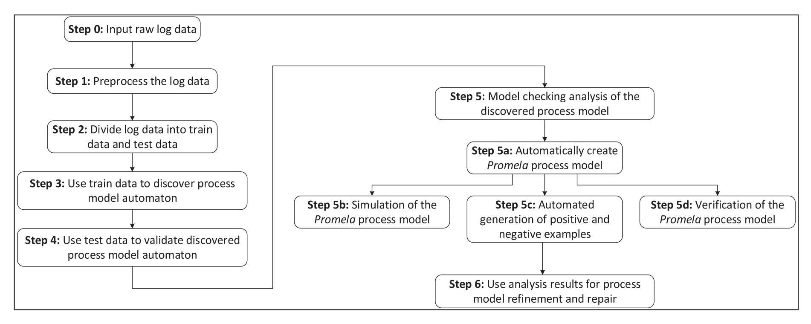

# Automated simulation and verification of process models discovered by process mining

### Abstract
This paper presents a novel approach for automated analysis of process models discovered using process mining techniques. Process mining explores underlying processes hidden in the event data generated by various devices. Our proposed Inductive machine learning method was used to build business process models based on actual event log data obtained from a hotel's Property Management System (PMS). The PMS can be considered as a Multi Agent System (MAS) because it is integrated with a variety of external systems and IoT devices. Collected event log combines data on guests stay recorded by hotel staff, as well as data streams captured from telephone exchange and other external IoT devices. Next, we performed automated analysis of the discovered process models using formal methods. Spin model checker was used to simulate process model executions and automatically verify the process model. We proposed an algorithm for the automatic transformation of the discovered process model into a verification model. Additionally, we developed a generator of positive and negative examples. In the verification stage, we have also used Linear temporal logic (LTL) to define requested system specifications. We find that the analysis results will be well suited for process model repair.

> Highly relevant paper with similar aims and method. Showcases a method with formal foundations, and has also contributed with many useful resources. The method presented in this paper partly forms the foundation of my project.

"..it is evident that, relative to process discovery, there are still far fewer techniques and tools for analysis of process models and process repair."

Presents a method with the following structure:  
**Overview of presented method:**
  - process synthesis
    - process discovery via inductive machine learning
    - produces *finite state automatons, encoded as directed graphswith labelled nodes and edges in Graphviz2 dot textual format*
  - evaluation and analysis of generated model
    - via model checking 
    - model is checked for specification conformance while being simulated
  - automatically transalte model from visuzlization format to validation format
    - translation via a series of scripts. From Graphviz^2 dot format to Promela.
  - perform process analysis (**Main contribution**)
    - by first performing process simulation (and model checking/specification conformance) via Spin model checker
    - use results to refine and repair the discovered process model (**How?**)

**Abstraction of presented method:**
  - [process discovery](#process-discovery) by using inductive machine learning
  - [model checking](#model-checking)
  - [model simulation](#simulation) by using spin model checker (**Main contribution**)
  - [process analysis](#process-analysis) by analyzing the generated process log (**Main contribution**)
  - model repair

> Figure taken from paper.   
> *Overview of the proposed method for proess synthesis, analysis and repair*  
> Steps 0-4 are process synthesis  
> Step 5 is the *automated analysis of the discovered process model. I.e the main contribution*

*The main contribution of this paper is our approach for **automated analysis of discovered process models based on model checking**.* The automated model checking technique is comprised of a series of scripts that translate the process model from dot format to Promela (Process meta language). The dot format is a specification used for model visualization in Graphviz^2. The promela model is then run in the Spin model checker. Spin can run random simulations of the process model or perform a verification of the process model by exploring all the possible execution paths. 

Process synthesis is based on a inductive machine learning algorithm using the *libalf* library. Based on the *finite automata theory*. Process discovery is implemented using an adaptation of the *k-tail algorithm / Biermann's algorithm*. 

Model checking is then used to analyse and evaluate the process model.  
A verification model is built from the discovered process model, which can be simulated and formally checked for specification performance using the *spin model checker*. Process analysis is then used to refine and repair the discovered process model. The spin model checker generates a process analyser C program for the given Promela process model. This is then compiled and executed. It then performs automatic verification of the Promela model by examining all possible execution paths. 

Spin supports three simulation types, default random simulations, interactive simulations, and guided simulations. 